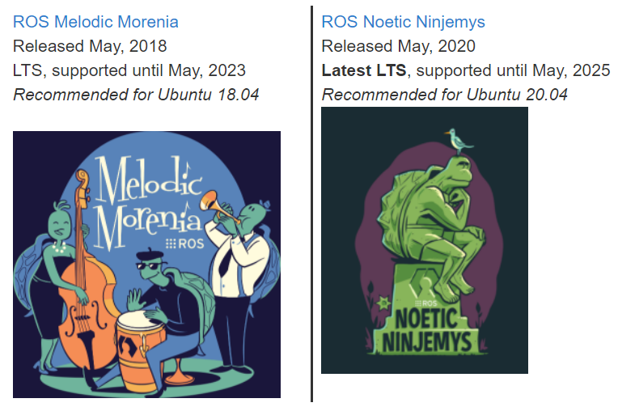
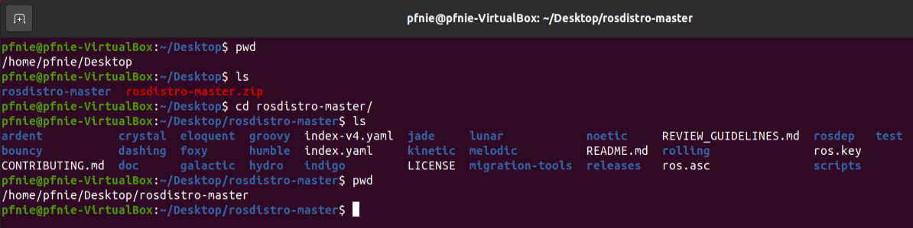

# ros-thinking

## 1. Introduction

There is more than one ROS distribution supported at a time. Some are older releases with long term support, making them more stable, while others are newer with shorter support life times, but with binaries for more recent platforms and more recent versions of the ROS packages that make them up.

[From ROS.org "Distributions" wiki](http://wiki.ros.org/Distributions#:~:text=Every ROS release will be,distributions after their release date)

> "A ROS distribution is a versioned set of ROS packages. These are akin to Linux distributions (e.g. Ubuntu). The purpose of the ROS distributions is to let developers work against a relatively stable codebase until they are ready to roll everything forward. Therefore once a distribution is released, we try to limit changes to bug fixes and non-breaking improvements for the core packages (every thing under ros-desktop-full). And generally that applies to the whole community, but for "higher" level packages, the rules are less strict, and so it falls to the maintainers of a given package to avoid breaking changes."

## 2. Installation

ROS is not strictly tied to Ubuntu-based operating systems; however, Ubuntu is the primarily supported operating system for ROS. "LTS" (long term support) distributions of ROS are synchronized with the LTS distributions of Ubuntu. To maximize compatibility, the distribution of ROS you install should match the version of Ubuntu you are running based on this list:

- Ubuntu 14.04.06 LTS (Trusty Tahr) --> ROS Indigo Igloo
- Ubuntu 16.04.7 LTS (Xenial Xerus) --> ROS Kinetic Kame
- Ubuntu 18.04.5 LTS (Bionic Beaver) --> ROS Melodic Morenia
- Ubuntu 20.04.1 LTS (Focal Fossa) --> ROS Noetic Ninjemys

 

[ROS/Installation - ROS Wiki](http://wiki.ros.org/ROS/Installation)

### 2.1 update software center address

Please find setting item, to choose about item, than update software center address.


### 2.2 ROS Noetic installation instructions

These instructions will install **ROS Noetic Ninjemys**, which is available for Ubuntu Focal (20.04), Debian Buster (10). [noetic/Installation/Ubuntu - ROS Wiki](http://wiki.ros.org/noetic/Installation/Ubuntu)

**fixed rosdep update issues**

step1 download into your local filesystem

[ros/rosdistro: This repo maintains a lists of repositories for each ROS distribution (github.com)](https://github.com/ros/rosdistro)



step2 update /etc/ros/rosdep/sources.list.d/20-default.list

```
sudo gedit /etc/ros/rosdep/sources.list.d/20-default.list
```

```
yaml file:///home/pfnie/Desktop/rosdistro-master/rosdep/osx-homebrew.yaml osx

# generic
yaml file:////home/pfnie/Desktop/rosdistro-master/rosdep/base.yaml
yaml file:///home/pfnie/Desktop/rosdistro-master/rosdep/python.yaml
yaml file:///home/pfnie/Desktop/rosdistro-master/rosdep/ruby.yaml
gbpdistro file:///home/pfnie/Desktop/rosdistro-master/releases/fuerte.yaml fuerte
```

step3 update /usr/lib/python3/dist-packages/rosdep2/sources_list.py  in line 72

```
sudo gedit /usr/lib/python3/dist-packages/rosdep2/sources_list.py
```

```
DEFAULT_SOURCES_LIST_URL = 'file:///home/pfnie/Desktop/rosdistro-master/rosdep/sources.list.d/20-default.list'
```

step4 update /usr/lib/python3/dist-packages/rosdep2/rep3.py  in line 39

```
sudo gedit /usr/lib/python3/dist-packages/rosdep2/rep3.py
```

```
REP3_TARGETS_URL = 'file:///home/pfnie/Desktop/rosdistro-master/releases/targets.yaml'
```

step5 update /usr/lib/python3/dist-packages/rosdistro/__init__.py  in line 68

```
sudo gedit /usr/lib/python3/dist-packages/rosdistro/__init__.py
```

```
DEFAULT_INDEX_URL = 'file:///home/pfnie/Desktop/rosdistro-master/index-v4.yaml'
```

step 6

```
sudo rosdep init
```

step 7

```
rosdep update
```
