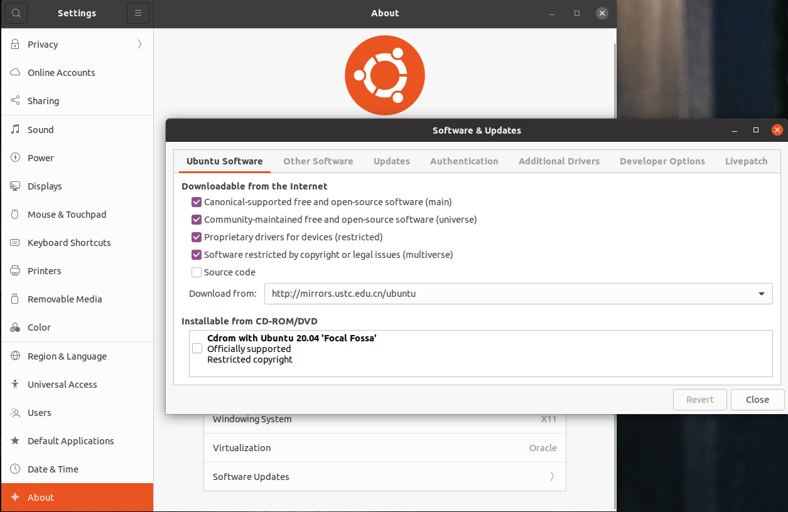
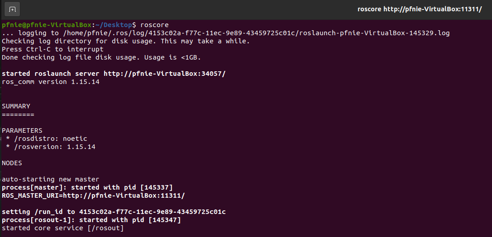

# 01 install on ubuntu

## 1. share folders between your ubuntu and your host

```
sudo apt install virtualbox-guest-utils
sudo adduser pfnie vboxsf
reboot
```

## 2. installation version guideline

ROS is not strictly tied to Ubuntu-based operating systems; however, Ubuntu is the primarily supported operating system for ROS. "LTS" (long term support) distributions of ROS are synchronized with the LTS distributions of Ubuntu. To maximize compatibility, the distribution of ROS you install should match the version of Ubuntu you are running based on this list:

- Ubuntu 14.04.06 LTS (Trusty Tahr) --> ROS Indigo Igloo
- Ubuntu 16.04.7 LTS (Xenial Xerus) --> ROS Kinetic Kame
- Ubuntu 18.04.5 LTS (Bionic Beaver) --> ROS Melodic Morenia
- Ubuntu 20.04.1 LTS (Focal Fossa) --> ROS Noetic Ninjemys 

[ROS/Installation - ROS Wiki](http://wiki.ros.org/ROS/Installation)

[http://wiki.ros.org/noetic/Installation/Ubuntu](http://wiki.ros.org/noetic/Installation/Ubuntu)

<iframe height="500" width="700" src="//player.bilibili.com/player.html?aid=352723718&bvid=BV1PX4y1X7v7&cid=1028876069&page=1" scrolling="no" border="0" frameborder="0" framespacing="0" allowfullscreen="true"> </iframe>

### 2.1 Configure your Ubuntu repositories

[https://help.ubuntu.com/community/Repositories/Ubuntu](https://help.ubuntu.com/community/Repositories/Ubuntu)



### 2.2 Setup your sources.list

Setup your computer to accept software from packages.ros.org.

```
sudo sh -c 'echo "deb http://packages.ros.org/ros/ubuntu $(lsb_release -sc) main" > /etc/apt/sources.list.d/ros-latest.list'
```


### 2.3 Set up your keys

```
sudo apt install curl # if you haven't already installed curl
```


```
curl -s https://raw.githubusercontent.com/ros/rosdistro/master/ros.asc | sudo apt-key add -
```


to resolve this issue "**gpg: no valid OpenPGP data found.**"

```
curl -O -k https://raw.githubusercontent.com/ros/rosdistro/master/ros.asc
sudo apt-key add ros.asc 
```


### 2.4 Installation

First, make sure your Debian package index is up-to-date:

```
sudo apt update
```


Now pick how much of ROS you would like to install.

**Desktop-Full Install: (Recommended)** : Everything in **Desktop** plus 2D/3D simulators and 2D/3D perception packages.

```
sudo apt install ros-noetic-desktop-full
```


There are even more packages available in ROS. You can always install a specific package directly.

**sudo apt install ros-noetic-PACKAGE**

e.g.

```
sudo apt install ros-noetic-slam-gmapping
```


To find available packages, see [ROS Index](https://index.ros.org/packages/page/1/time/#noetic) or use:

```
apt search ros-noetic
```


### 2.5 Environment setup

You must source this script in every **bash** terminal you use ROS in.

```
source /opt/ros/noetic/setup.bash
```

It can be convenient to automatically source this script every time a new shell is launched. These commands will do that for you.

```
echo "source /opt/ros/noetic/setup.bash" >> ~/.bashrc
source ~/.bashrc
```


### 2.6 Dependencies for building packages

```
sudo apt install python3-rosdep python3-rosinstall python3-rosinstall-generator python3-wstool build-essential
```


### 2.7 Initialize rosdep

Before you can use many ROS tools, you will need to initialize `rosdep`. `rosdep` enables you to easily install system dependencies for source you want to compile and is required to run some core components in ROS. If you have not yet installed `rosdep`, do so as follows.

```
sudo apt install python3-rosdep
```


With the following, you can initialize `rosdep`.

```
sudo rosdep init
rosdep update
```


```
roscore
```



**Reference：**

1. [How to share folders between your Ubuntu Virtualbox and your host machine](https://net2.com/how-to-share-folders-between-your-ubuntu-virtualbox-and-your-host-machine/)
