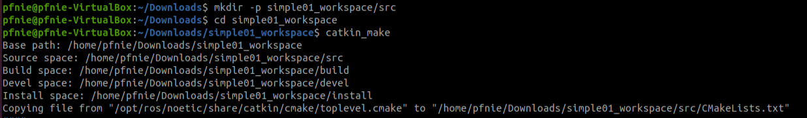

# hello world

**Step1: create workspace and initialization**

```
mkdir -p simple01_workspace/src
cd simple01_workspace
catkin_make
```



**Step2: create dependency package**

```
cd src
catkin_create_pkg roscpp rospy std_msgs
```

The above command will generate a function package in the workspace, which depends on roscpp, rospy and std_msgs, where roscpp is a library implemented in C++, rospy is a library implemented in python, and std_msgs is a standard message library. Create When ROS function packages are used, they generally rely on these three libraries for implementation.

**Step3: add hello.cp in src folder**

```c++
#include "ros/ros.h"

int main(int argc, char *argv[])
{
    ros::init(argc,argv,"hello");
    ros::NodeHandle n;
    ROS_INFO("hello world!");
    return 0;
}
```

**Step4: update CMakelist.txt**

```
add_executable(hello src/hello.cpp)
target_link_libraries(hello ${catkin_LIBRARIES})
```

**Step5: make**

```
cd simple01_workspace
catkin_make
```

**Step6:  start roscore**

```
roscore
```

**Step7:  start hello**

```
cd simple01_workspace
source ./devel/setup.bash
rosrun hello hello
```

