# hello world custom msg for pub and sub 

## 1. background

In previous tutorials you utilized message and service interfaces to learn about topics, and simple publisher/subscriber nodes. The interfaces you used were predefined in those cases.

While it’s good practice to use predefined interface definitions, you will probably need to define your own messages as well. This tutorial will introduce you to the simplest method of creating custom interface definitions.

## 2. Tasks

**Step1: create workspace and initialization**

```
mkdir -p simple04_workspace/src
cd simple04_workspace
catkin_make
```

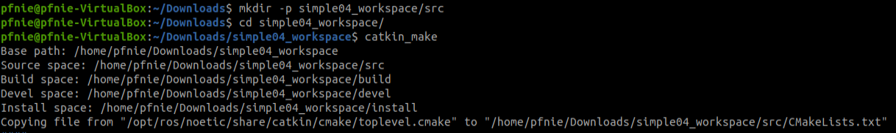

**Step2: start vscode**

```
cd simple04_workspace
code .
```

**Step3: compile ros in vscode**

using ***ctrl + shift + B*** to select ***catkin_make:build***

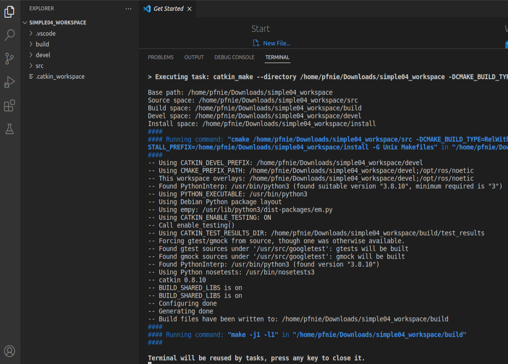

**Step4: config tasks.json**

select ***Configure Default Build Task...*** , then please hit ***catkin_make:build***

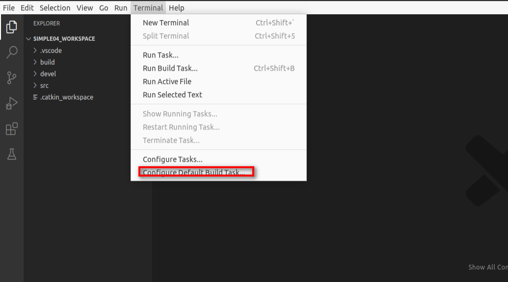

the task.json as below:

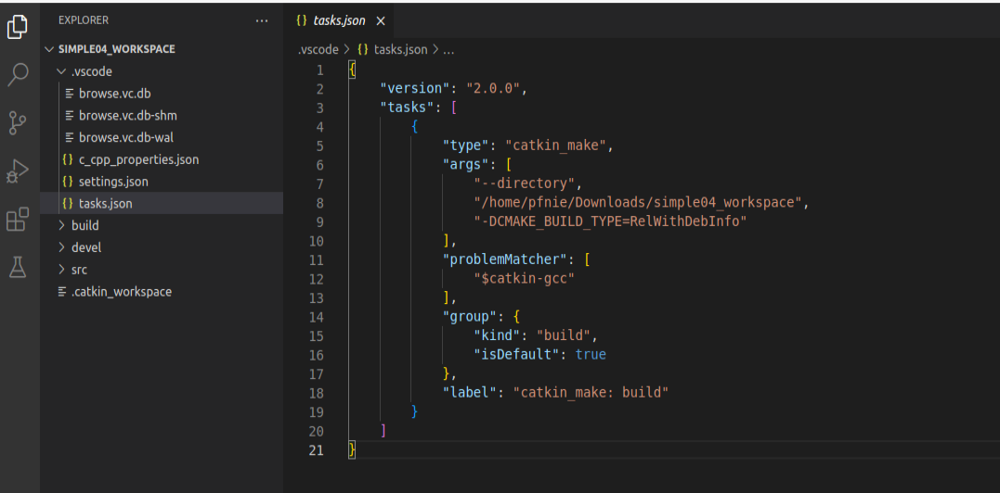

**Step5: create ros package**

Selected src right click ---> create catkin package

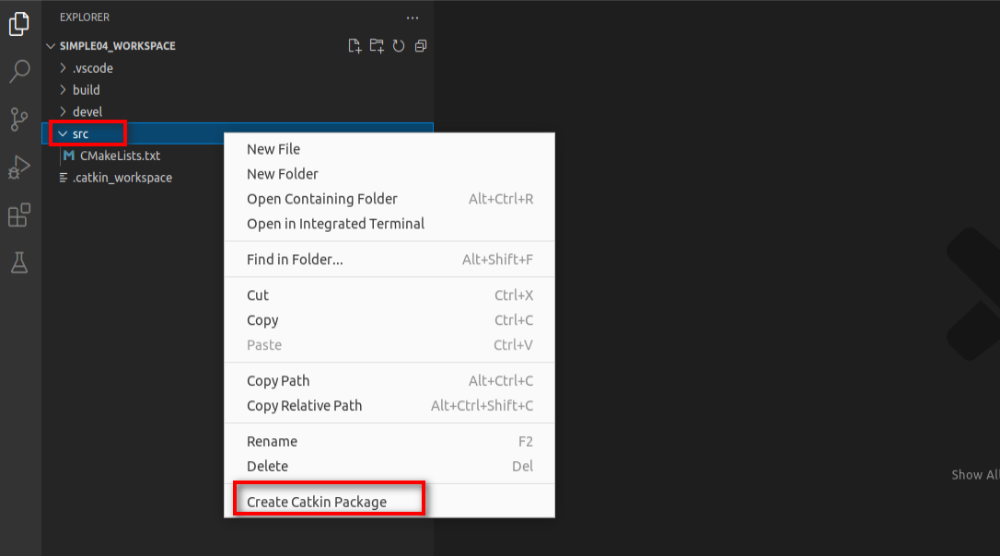

please type your package and dependencies.

```
hello_custom_msg_pub_sub
roscpp rospy std_msgs
```

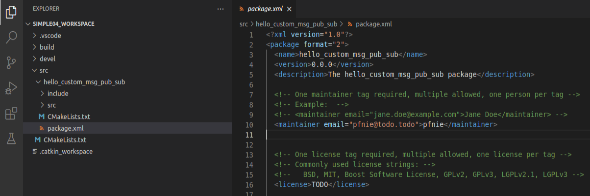

**Step6: create msg package and add Person.msg**

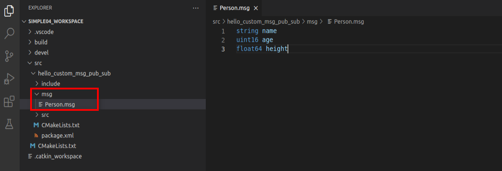

**Step7: update package.xml**

```
 <build_depend>message_generation</build_depend>
 <exec_depend>message_runtime</exec_depend>
```

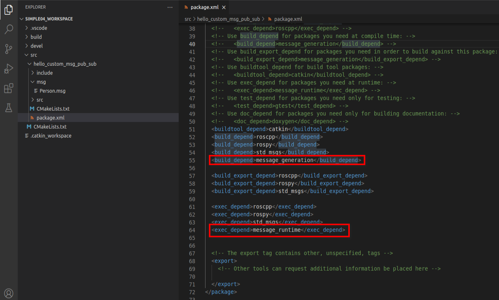

**Step8: config CMakelists.txt**

```
## Find catkin macros and libraries
## if COMPONENTS list like find_package(catkin REQUIRED COMPONENTS xyz)
## is used, also find other catkin packages
find_package(catkin REQUIRED COMPONENTS
  roscpp
  rospy
  std_msgs
  message_generation
)
```

```
add_message_files(
  FILES
  Person.msg
)
```

```
generate_messages(
  DEPENDENCIES
  std_msgs
)
```

```
catkin_package(
#  INCLUDE_DIRS include
   CATKIN_DEPENDS roscpp rospy std_msgs message_runtime
#  DEPENDS system_lib
)
```

**Step9: compile**

using ***ctrl + shift + B*** to select ***catkin_make:build***

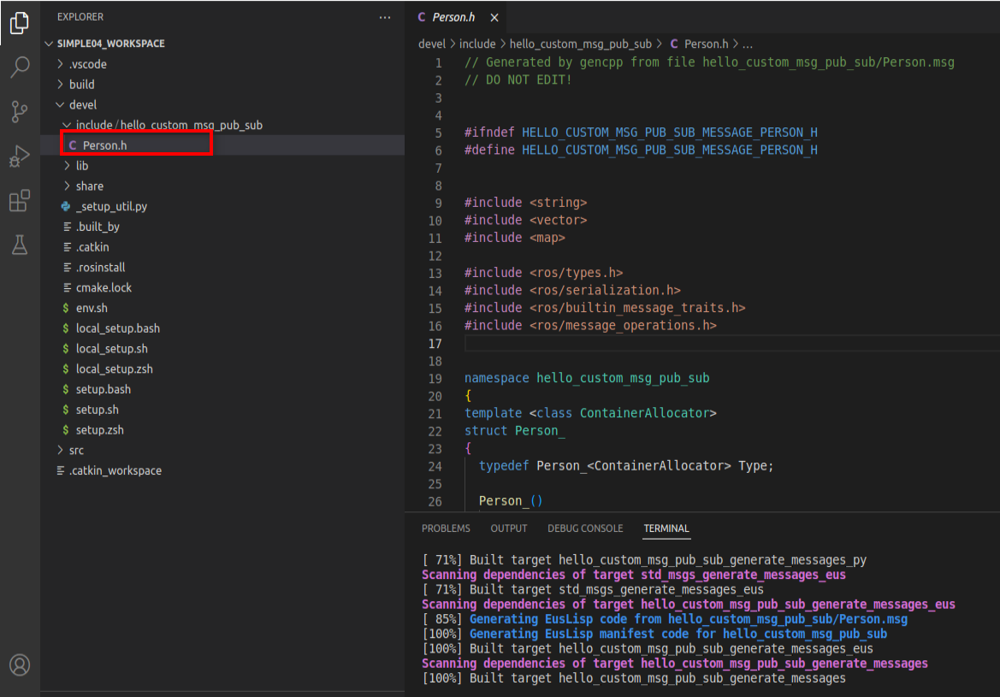

**Step10: update c_cpp_properties.json**

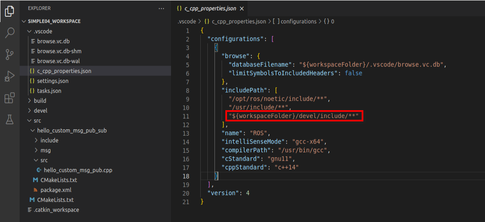

**Step11: add hello_custom_msg_pub.cpp in src folder**

```
#include "ros/ros.h"
#include "hello_custom_msg_pub_sub/Person.h"

int main(int argc, char *argv[])
{
    setlocale(LC_ALL,"");
    ros::init(argc,argv,"talker_person");
    ros::NodeHandle nh;
    ros::Publisher pub = nh.advertise<hello_custom_msg_pub_sub::Person>("chatter_person",1000);
    hello_custom_msg_pub_sub::Person p;
    p.name = "zhangsan";
    p.age = 2000;
    p.height = 1.45;

    ros::Rate r(1);
    while (ros::ok())
    {
        pub.publish(p);
        p.age += 1;
        ROS_INFO("我叫:%s,今年%d岁,高%.2f米", p.name.c_str(), p.age, p.height);
        r.sleep();
        ros::spinOnce();
    }
    return 0;
}
```

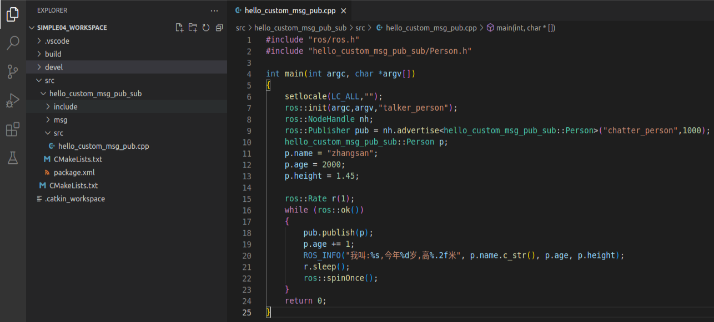

**Step12: add hello_custom_msg_sub.cpp in src folder**

```
#include "ros/ros.h"
#include "hello_custom_msg_pub_sub/Person.h"

void doPerson(const hello_custom_msg_pub_sub::Person::ConstPtr& person_p){
    ROS_INFO("订阅的人信息:%s, %d, %.2f", person_p->name.c_str(), person_p->age, person_p->height);
}

int main(int argc, char *argv[])
{   
    setlocale(LC_ALL,"");
    ros::init(argc,argv,"listener_person");
    ros::NodeHandle nh;
    ros::Subscriber sub=nh.subscribe<hello_custom_msg_pub_sub::Person>("chatter_person",10,doPerson);
    ros::spin();    
    return 0;
}

```

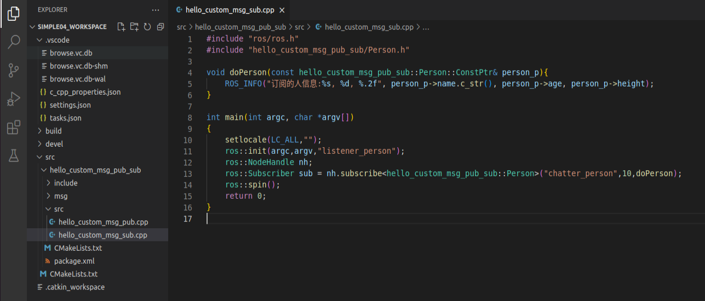

**Step13: config CMakelists.txt**

```
add_executable(hello_custom_msg_pub src/hello_custom_msg_pub.cpp)
add_executable(hello_custom_msg_sub src/hello_custom_msg_sub.cpp)
add_dependencies(hello_custom_msg_pub ${PROJECT_NAME}_generate_messages_cpp)
add_dependencies(hello_custom_msg_sub ${PROJECT_NAME}_generate_messages_cpp)
target_link_libraries(hello_custom_msg_pub ${catkin_LIBRARIES})
target_link_libraries(hello_custom_msg_sub ${catkin_LIBRARIES})
```

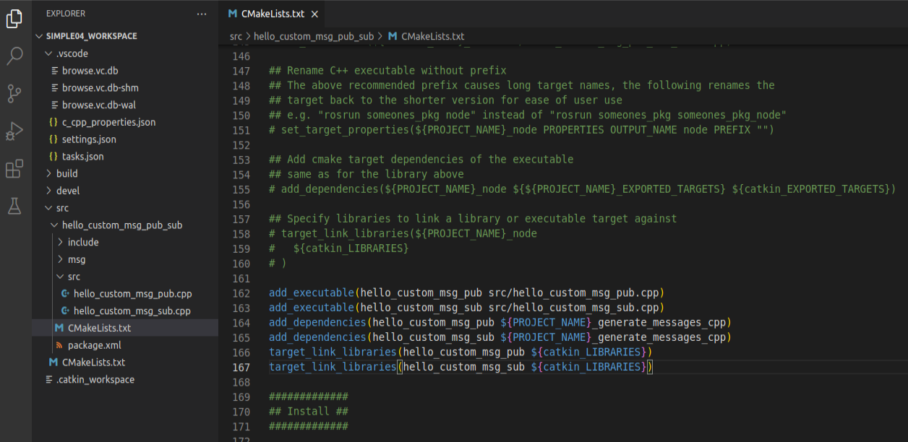

**Step14:  compile**

ctrl + shift + B

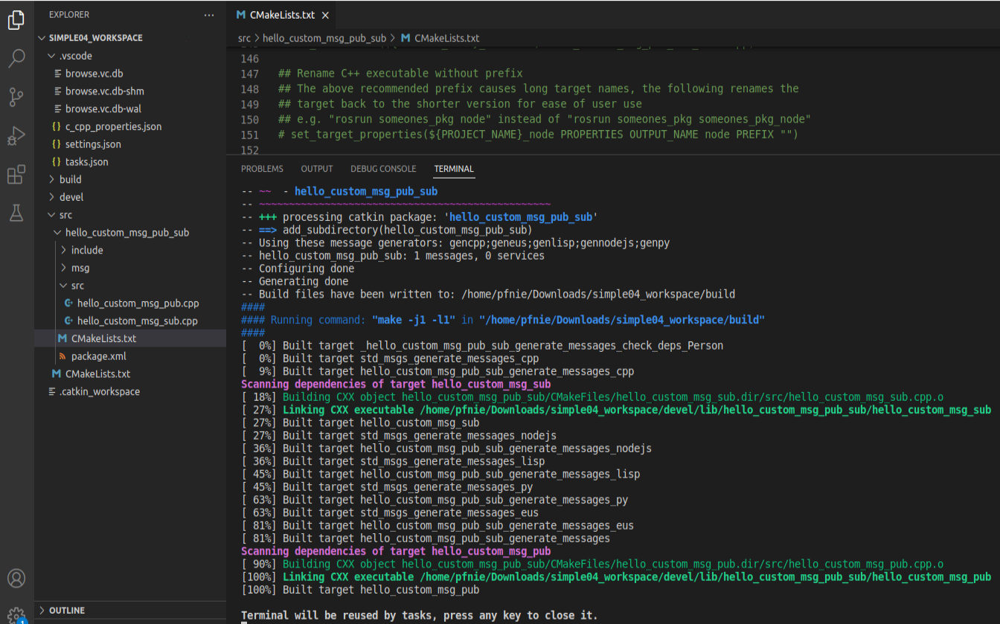

**Step15:  start roscore** **& start hello_command**

```
roscore

cd simple04_workspace
source ./devel/setup.bash
rosrun hello_custom_msg_pub_sub hello_custom_msg_pub
rosrun hello_custom_msg_pub_sub hello_custom_msg_sub
```

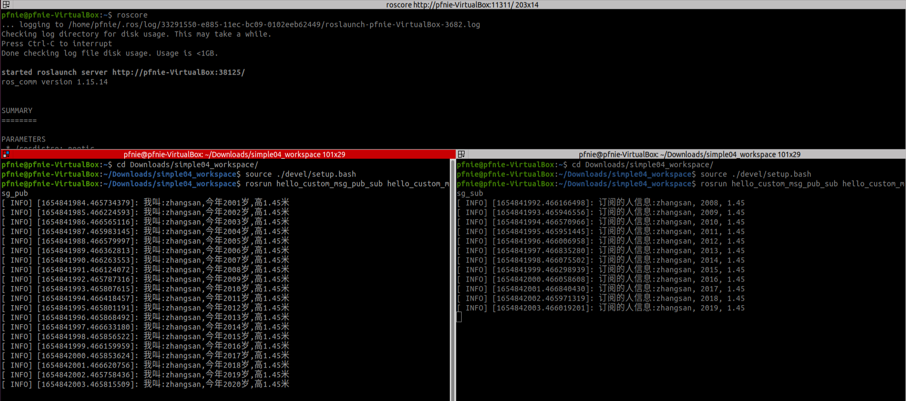

**Reference：**

1. [http://wiki.ros.org/action/fullsearch/catkin/commands/catkin_make](http://wiki.ros.org/action/fullsearch/catkin/commands/catkin_make)
2. [https://docs.ros.org/en/rolling/Tutorials/Writing-A-Simple-Cpp-Publisher-And-Subscriber.html](https://docs.ros.org/en/rolling/Tutorials/Writing-A-Simple-Cpp-Publisher-And-Subscriber.html)
3. [http://wiki.ros.org/es/ROS/Tutoriales/WritingPublisherSubscriber(c%2B%2B)](http://wiki.ros.org/es/ROS/Tutoriales/WritingPublisherSubscriber(c%2B%2B))
