# hello world custom message for publisher and subscriber 

## 1. background

Nodes are executable processes that communicate over the ROS graph. In this tutorial, the nodes will pass information in the form of string messages to each other over a topic. 

## 2. Tasks

**Step1: create workspace and initialization**

```
mkdir -p simple03_workspace/src
cd simple03_workspace
catkin_make
```

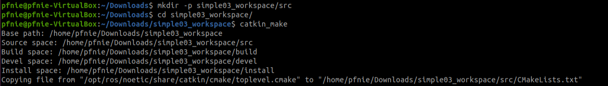

**Step2: start vscode**

```
cd simple03_workspace
code .
```

**Step3: compile ros in vscode**

using ***ctrl + shift + B*** to select ***catkin_make:build***

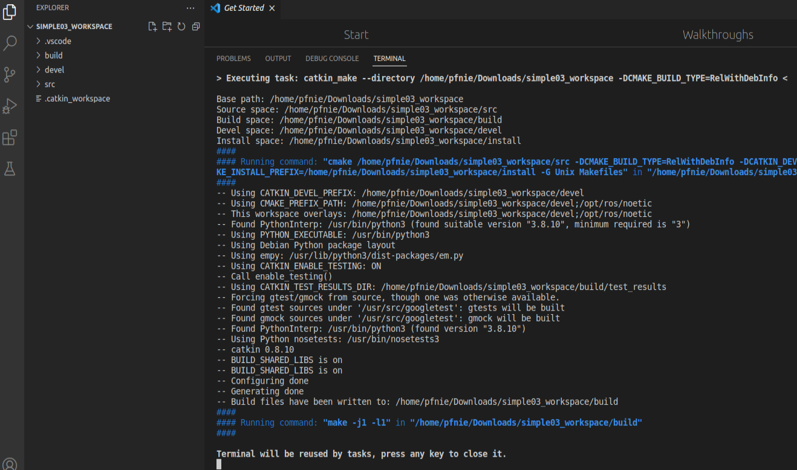

**Step4: config tasks.json**

select ***Configure Default Build Task...*** , then please hit ***catkin_make:build***

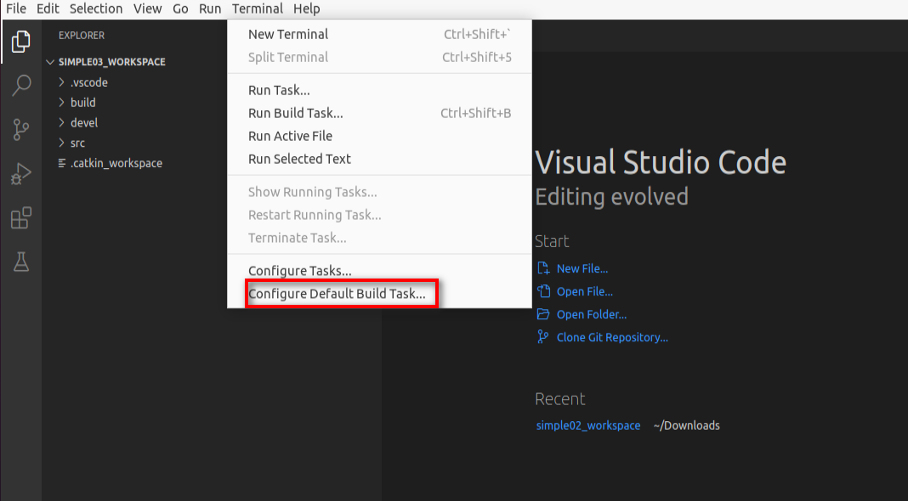

the task.json as below:

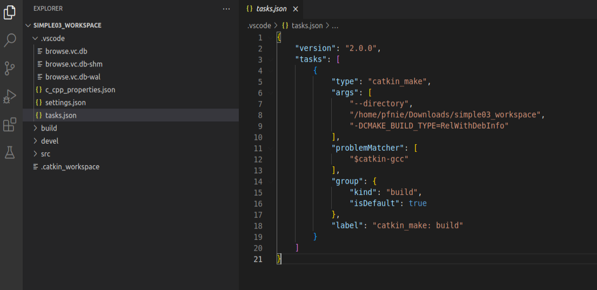

**Step5: create ros package**

Selected src right click ---> create catkin package

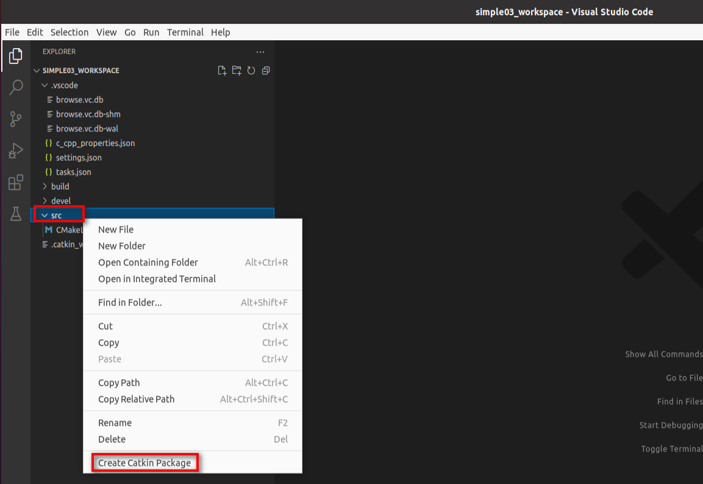

please type your package and dependencies.

```
hello_pub_sub
roscpp rospy std_msgs
```

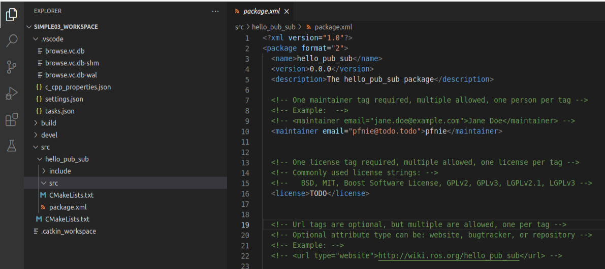

**Step6: add hello_pub.cpp in src folder**

```
#include "ros/ros.h"
#include "std_msgs/String.h"
#include <sstream>

int main(int argc, char  *argv[])
{   
    setlocale(LC_ALL,"");
    ros::init(argc,argv,"hello_pub");
    ros::NodeHandle nh;
    ros::Publisher pub = nh.advertise<std_msgs::String>("chatter",10);
    std_msgs::String msg;
    std::string msg_front = "Hello 你好！"; 
    int count = 0; 
    ros::Rate r(1);
    while (ros::ok())
    {
        std::stringstream ss;
        ss << msg_front << count;
        msg.data = ss.str();
        pub.publish(msg);
        ROS_INFO("发送的消息:%s",msg.data.c_str());
        r.sleep();
        count++;
        ros::spinOnce();
    }
    return 0;
}
```

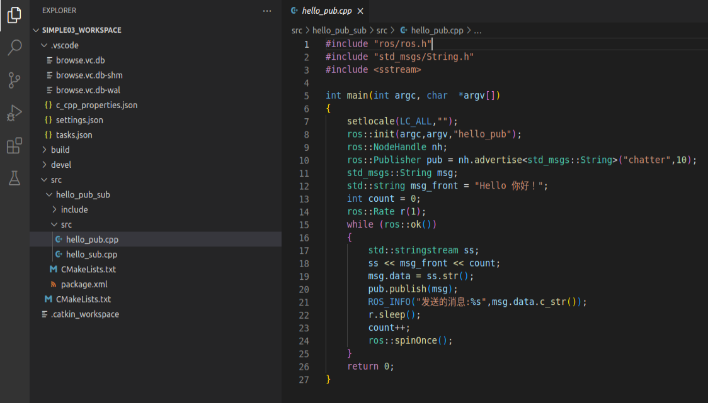

**Step7: add hello_sub.cpp in src folder**

```
#include "ros/ros.h"
#include "std_msgs/String.h"

void doMsg(const std_msgs::String::ConstPtr& msg_p){
    ROS_INFO("I am receiving :%s",msg_p->data.c_str());
}
int main(int argc, char  *argv[])
{
    setlocale(LC_ALL,"");
    ros::init(argc,argv,"hello_sub");
    ros::NodeHandle nh;
    ros::Subscriber sub = nh.subscribe<std_msgs::String>("chatter",10,doMsg);
    ros::spin();
    return 0;
}

```

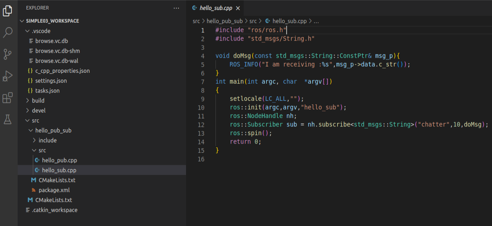

**Step8: config CMakelists.txt**

```
add_executable(hello_pub src/hello_pub.cpp)
add_executable(hello_sub src/hello_sub.cpp)
target_link_libraries(hello_pub ${catkin_LIBRARIES})
target_link_libraries(hello_sub ${catkin_LIBRARIES})
```

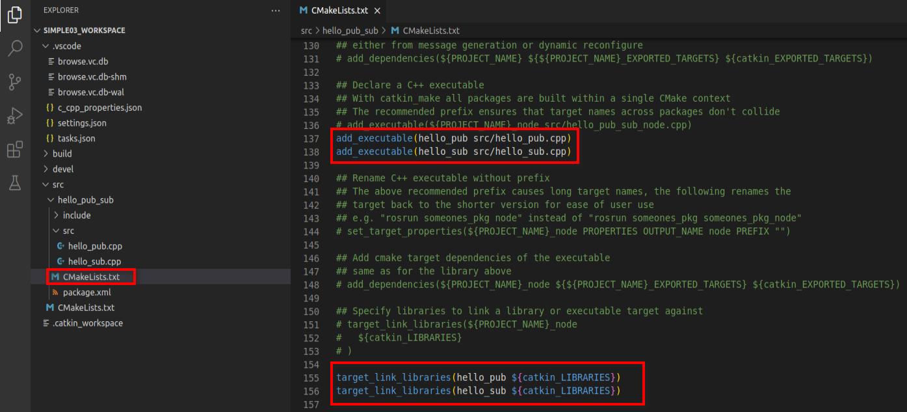

**Step8:  compile**

ctrl + shift + B

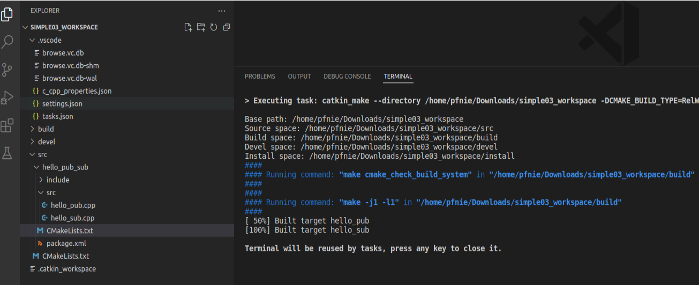

**Step9:  start roscore** **& start hello_command**

```
roscore

cd simple03_workspace
source ./devel/setup.bash
rosrun hello_pub_sub hello_pub
rosrun hello_pub_sub hello_sub
```

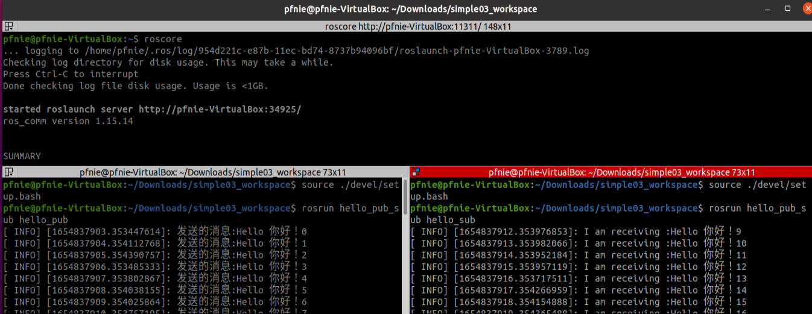

**Reference：**

1. http://wiki.ros.org/action/fullsearch/catkin/commands/catkin_make
2. https://docs.ros.org/en/rolling/Tutorials/Writing-A-Simple-Cpp-Publisher-And-Subscriber.html
3. http://www.autolabor.com.cn/book/ROSTutorials/chapter1.html
