# 05 hello world for service and client 

## 1. background

Here we'll create the service node which will receive two ints and return the sum.

## 2. Tasks

**Step1: create workspace and initialization**

```
mkdir -p simple05_workspace/src
cd simple05_workspace
catkin_make
```

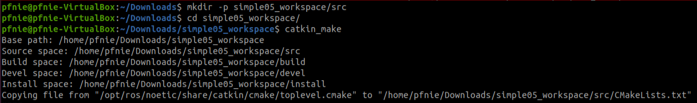

**Step2: start vscode**

```
cd simple05_workspace
code .
```

**Step3: compile ros in vscode**

using ***ctrl + shift + B*** to select ***catkin_make:build***

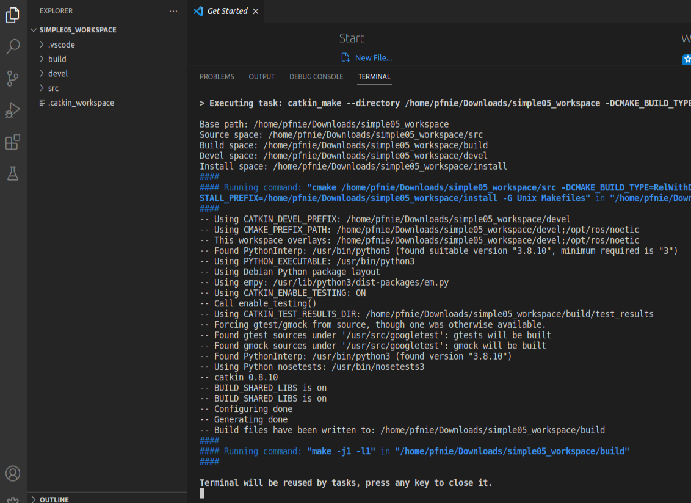

**Step4: config tasks.json**

select ***Configure Default Build Task...*** , then please hit ***catkin_make:build***

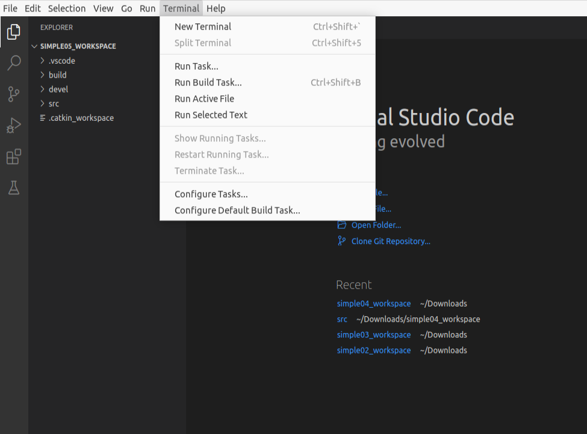

the task.json as below:

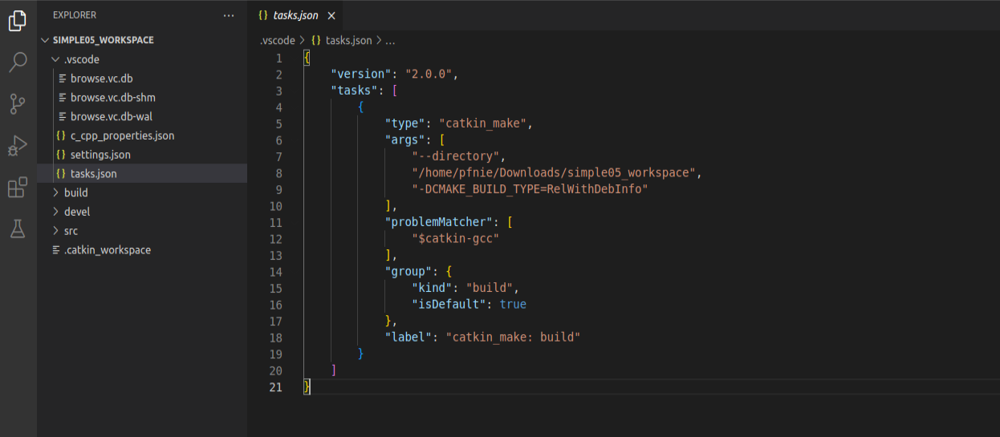

**Step5: create ros package**

Selected src right click ---> create catkin package

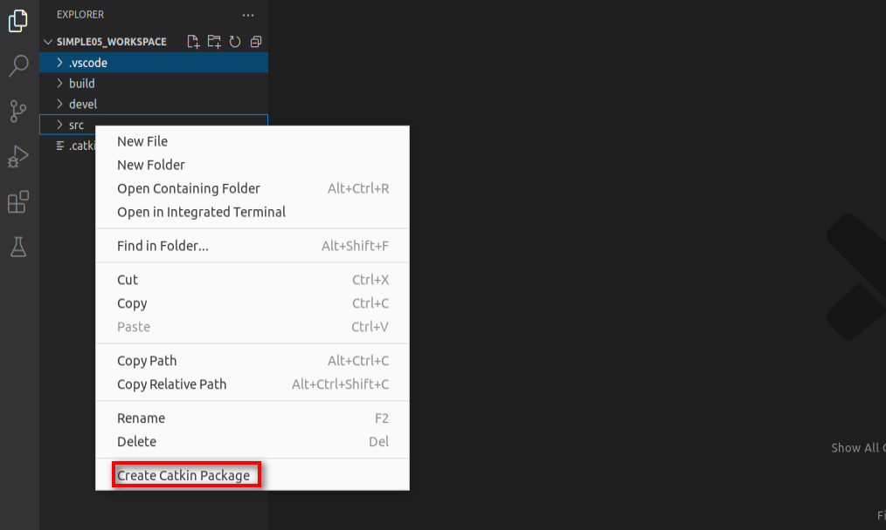

please type your package and dependencies.

```
hello_service_server_client
roscpp rospy std_msgs
```

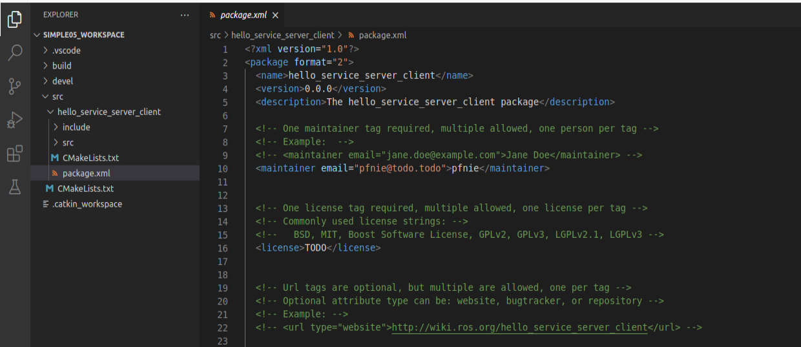

**Step6: create srv package and add AddInts.srv**

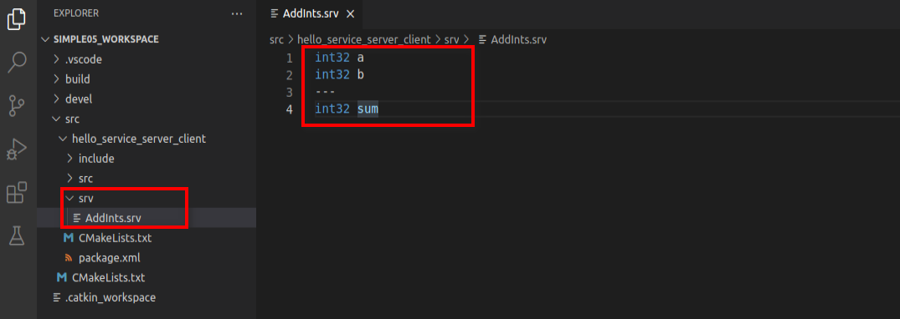

**Step7: update package.xml**

```
 <build_depend>message_generation</build_depend>
 <exec_depend>message_runtime</exec_depend>
```

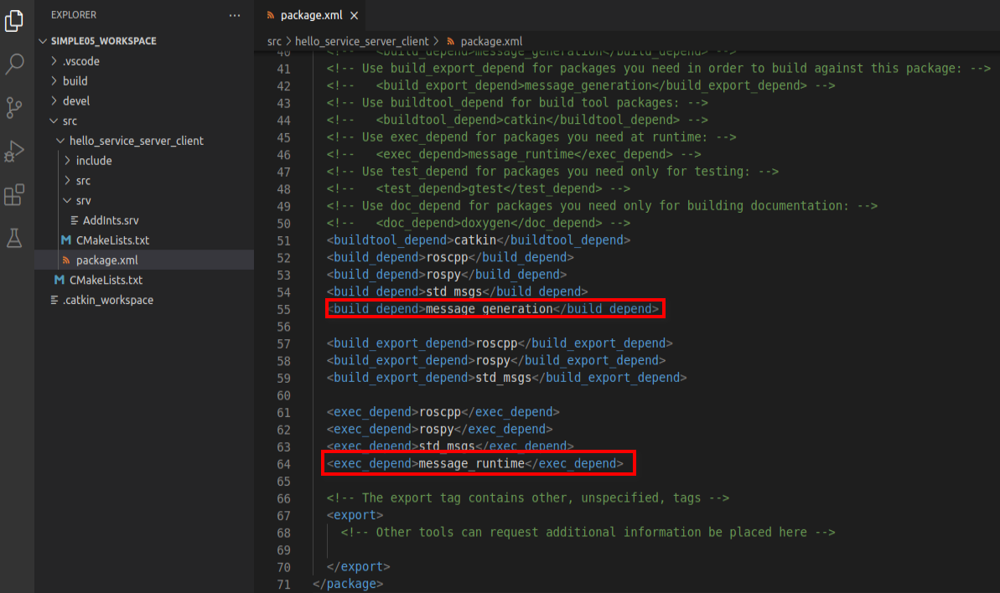

**Step8: config CMakelists.txt**

```
## Find catkin macros and libraries
## if COMPONENTS list like find_package(catkin REQUIRED COMPONENTS xyz)
## is used, also find other catkin packages
find_package(catkin REQUIRED COMPONENTS
  roscpp
  rospy
  std_msgs
  message_generation
)
```

```
add_service_files(
  FILES
  AddInts.srv
)
```

```
generate_messages(
  DEPENDENCIES
  std_msgs
)
```

```
catkin_package(
#  INCLUDE_DIRS include
#  LIBRARIES hello_service_server_client
   CATKIN_DEPENDS roscpp rospy std_msgs message_runtime
#  DEPENDS system_lib
)
```

**Step9: compile**

using ***ctrl + shift + B*** to select ***catkin_make:build***


**Step10: update c_cpp_properties.json**

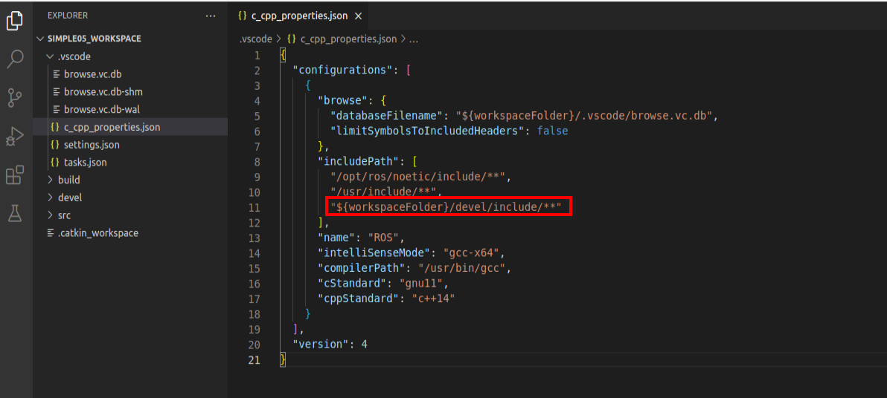

**Step11: add hello_service_server.cpp in src folder**

```
#include "ros/ros.h"
#include "hello_service_server_client/AddInts.h"

bool doReq(hello_service_server_client::AddInts::Request& req,
hello_service_server_client::AddInts::Response& resp){
    int num1 = req.a;
    int num2 = req.b;

    ROS_INFO("服务器接收到的请求数据为:num1 = %d, num2 = %d",num1, num2);
    if (num1 < 0 || num2 < 0)
    {
        ROS_ERROR("提交的数据异常:数据不可以为负数");
        return false;
    }
    resp.sum = num1 + num2;
    return true;
}

int main(int argc, char *argv[])
{
    setlocale(LC_ALL,"");

    ros::init(argc,argv,"AddInts_Server");
    ros::NodeHandle nh;
    ros::ServiceServer server = nh.advertiseService("AddInts",doReq);
    ROS_INFO("服务已经启动....");
    ros::spin();
    return 0;
}
```

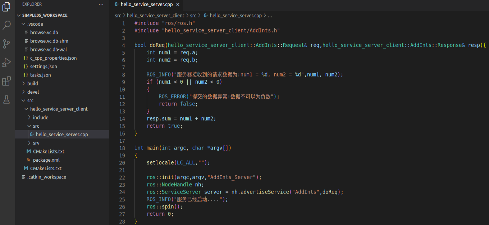

**Step12: add hello_service_client.cpp in src folder**

```
#include "ros/ros.h"
#include "hello_service_server_client/AddInts.h"

int main(int argc, char *argv[])
{
    setlocale(LC_ALL,"");
    if (argc != 3)
    {
        ROS_ERROR("请提交两个整数");
        return 1;
    }
    ros::init(argc,argv,"AddInts_Client");
    ros::NodeHandle nh;
    ros::ServiceClient client = nh.serviceClient<hello_service_server_client::AddInts>("AddInts");
    //
    ros::service::waitForService("AddInts");
    //
    // client.waitForExistence();
    hello_service_server_client::AddInts ai;
    ai.request.a = atoi(argv[1]);
    ai.request.b = atoi(argv[2]);
    bool flag = client.call(ai);
    if (flag)
    {
        ROS_INFO("请求正常处理,响应结果:%d",ai.response.sum);
    }
    else
    {
        ROS_ERROR("请求处理失败....");
        return 1;
    }

    return 0;
}
```


**Step13: config CMakelists.txt**

```
add_executable(hello_service_server src/hello_service_server.cpp)
add_executable(hello_service_client src/hello_service_client.cpp)
add_dependencies(hello_service_server hello_service_server_client_generate_messages_cpp)
add_dependencies(hello_service_client hello_service_server_client_generate_messages_cpp)
target_link_libraries(hello_service_server ${catkin_LIBRARIES})
target_link_libraries(hello_service_client ${catkin_LIBRARIES})
```

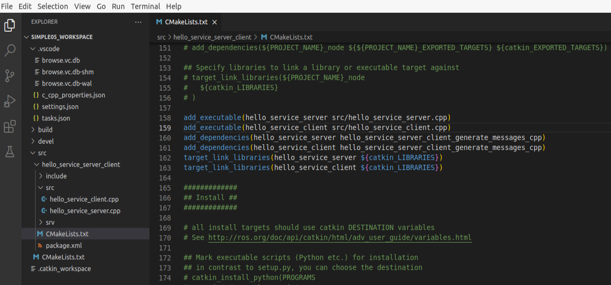

**Step14:  compile**

ctrl + shift + B

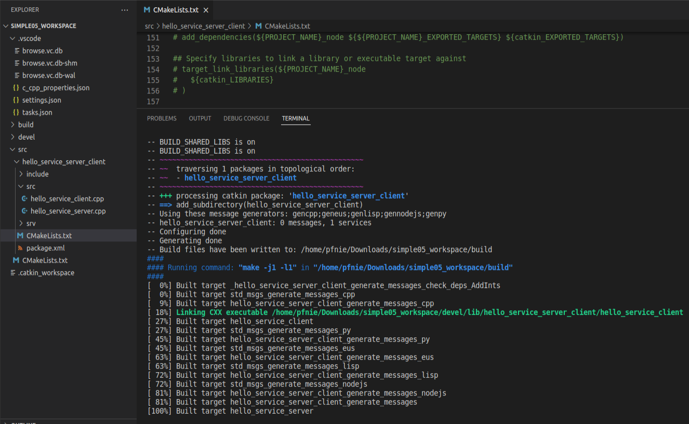

**Step15:  start roscore** **& start hello_command**

```
roscore

cd simple05_workspace
source ./devel/setup.bash
rosrun hello_service_server_client hello_service_server
rosrun hello_service_server_client hello_service_client 10 20
```

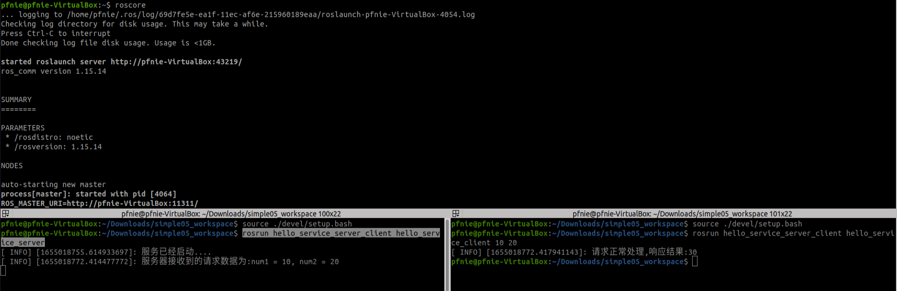

<video width="700" controls>
	<source src="/en/latest/_static/hello_service_server_client01.mp4" />
</video>

**Reference：**

1. [http://wiki.ros.org/action/fullsearch/catkin/commands/catkin_make](http://wiki.ros.org/action/fullsearch/catkin/commands/catkin_make)
2. [http://wiki.ros.org/ROS/Tutorials/ExaminingServiceClient](http://wiki.ros.org/ROS/Tutorials/ExaminingServiceClient)
3. [http://wiki.ros.org/ROS/Tutorials/WritingServiceClient(c%2B%2B)](http://wiki.ros.org/ROS/Tutorials/WritingServiceClient(c%2B%2B))
4. [https://sir.upc.edu/projects/rostutorials/5-client-server_tutorial/index.html](https://sir.upc.edu/projects/rostutorials/5-client-server_tutorial/index.html)
