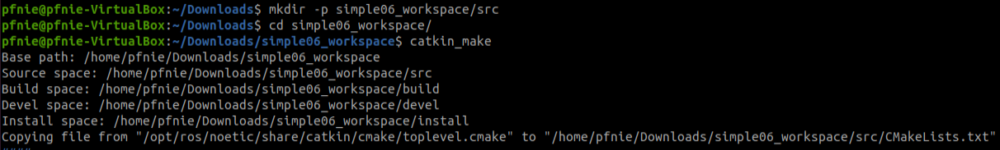
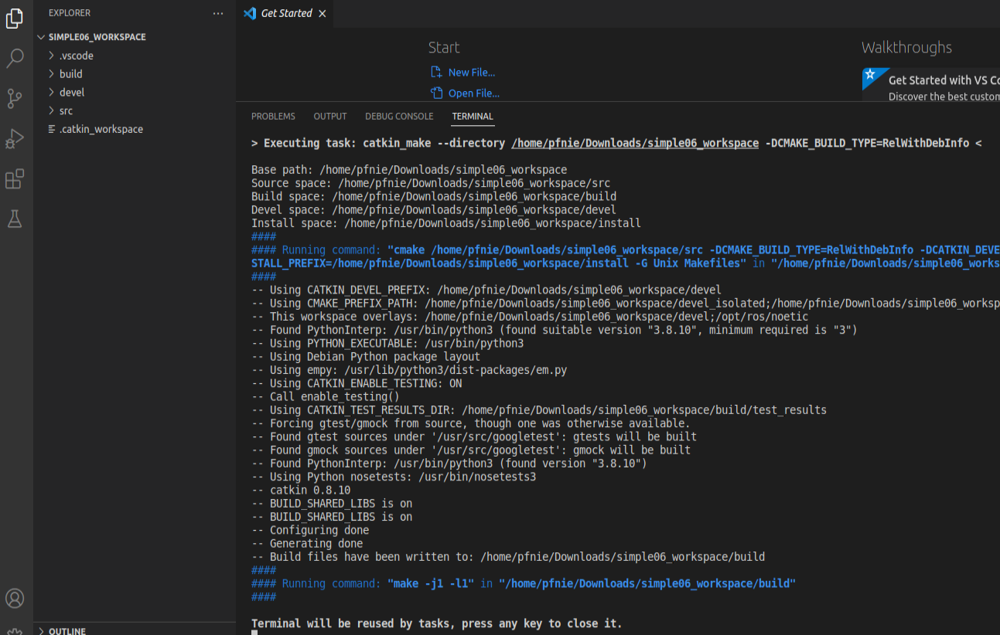
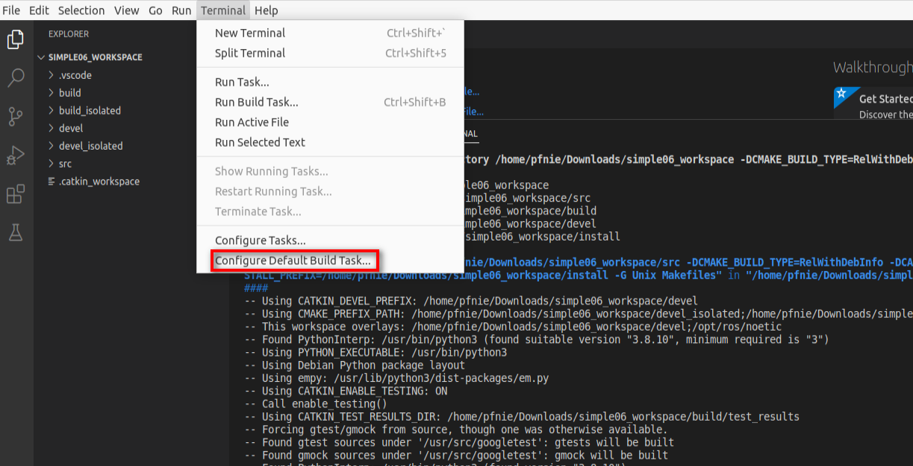
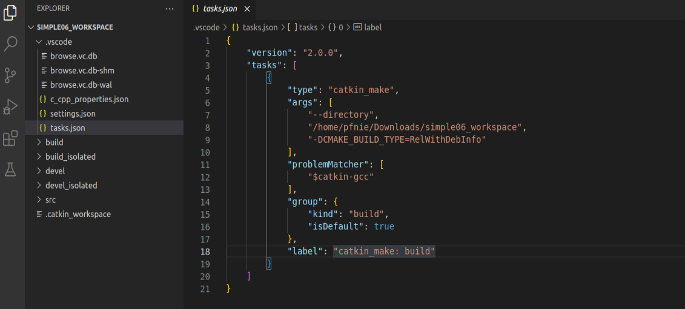
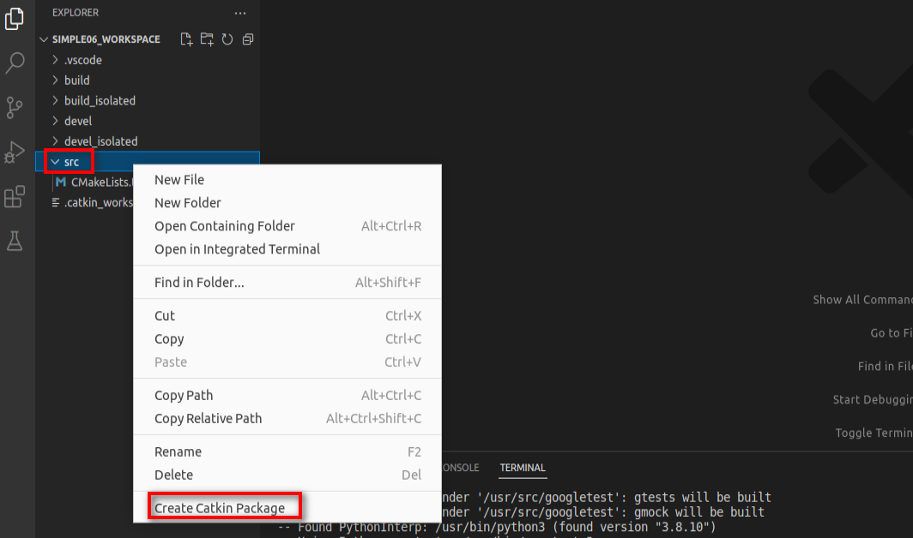
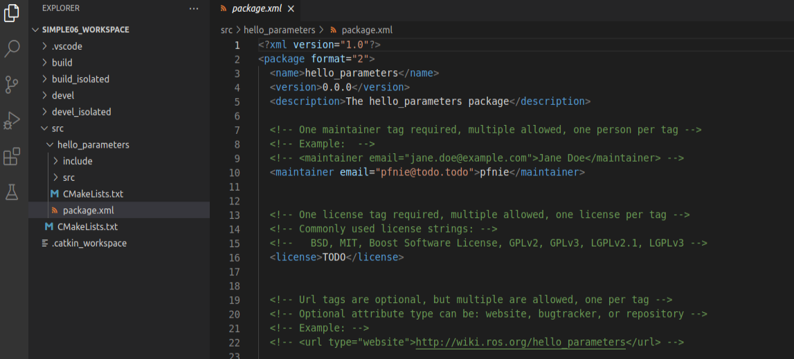
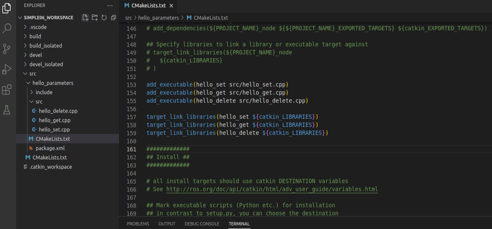
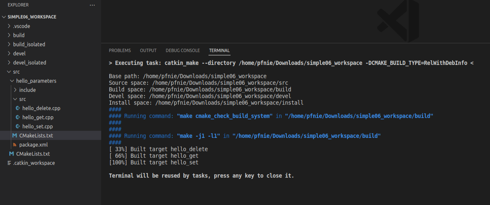
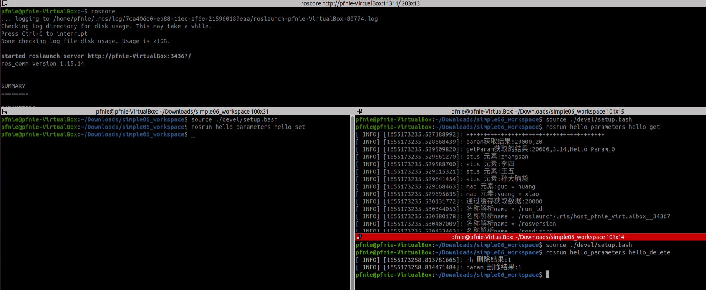

# hello world for **param**eters

## 1. background

ROS has a centralized **parameter server** that keeps track of a collection of values, to be queried by the nodes, that basically store configuration information that does not change (much) over time.

The C++ interface to ROS parameters is straightforward:

- *void ros::param::set(parameter_name, input_value);*
- *bool ros::param::get(parameter_name, output_value);*

## 2. Tasks

**Step1: create workspace and initialization**

```
mkdir -p simple06_workspace/src
cd simple06_workspace
catkin_make
```



**Step2: start vscode**

```
cd simple06_workspace
code .
```

**Step3: compile ros in vscode**

using ***ctrl + shift + B*** to select ***catkin_make:build***



**Step4: config tasks.json**

select ***Configure Default Build Task...*** , then please hit ***catkin_make:build***



the task.json as below:



**Step5: create ros package**

Selected src right click ---> create catkin package



please type your package and dependencies.

```
hello_parameters
roscpp rospy std_msgs
```



**Step6: add hello_set.cpp & hello_get.cpp & hello_delete.cpp**

```
#include "ros/ros.h"

int main(int argc, char *argv[])
{
    ros::init(argc,argv,"hello");

    std::vector<std::string> stus;
    stus.push_back("zhangsan");
    stus.push_back("李四");
    stus.push_back("王五");
    stus.push_back("孙大脑袋");

    std::map<std::string,std::string> friends;
    friends["guo"] = "huang";
    friends["yuang"] = "xiao";

    //NodeHandle--------------------------------------------------------
    ros::NodeHandle nh;
    nh.setParam("nh_int",10);
    nh.setParam("nh_double",3.14);
    nh.setParam("nh_bool",true); 
    nh.setParam("nh_string","hello NodeHandle"); 
    nh.setParam("nh_vector",stus); 
    nh.setParam("nh_map",friends); 

    //修改演示(相同的键，不同的值)
    nh.setParam("nh_int",10000);

    //param--------------------------------------------------------
    ros::param::set("param_int",20);
    ros::param::set("param_double",3.14);
    ros::param::set("param_string","Hello Param");
    ros::param::set("param_bool",false);
    ros::param::set("param_vector",stus);
    ros::param::set("param_map",friends);

    //修改演示(相同的键，不同的值)
    ros::param::set("param_int",20000);

    return 0;
}
```

```
#include "ros/ros.h"

int main(int argc, char *argv[])
{
    setlocale(LC_ALL,"");
    ros::init(argc,argv,"get_param");

    //NodeHandle--------------------------------------------------------
    /*
    ros::NodeHandle nh;
    // param 函数
    int res1 = nh.param("nh_int",100); // 键存在
    int res2 = nh.param("nh_int2",100); // 键不存在
    ROS_INFO("param获取结果:%d,%d",res1,res2);

    // getParam 函数
    int nh_int_value;
    double nh_double_value;
    bool nh_bool_value;
    std::string nh_string_value;
    std::vector<std::string> stus;
    std::map<std::string, std::string> friends;

    nh.getParam("nh_int",nh_int_value);
    nh.getParam("nh_double",nh_double_value);
    nh.getParam("nh_bool",nh_bool_value);
    nh.getParam("nh_string",nh_string_value);
    nh.getParam("nh_vector",stus);
    nh.getParam("nh_map",friends);

    ROS_INFO("getParam获取的结果:%d,%.2f,%s,%d",
            nh_int_value,
            nh_double_value,
            nh_string_value.c_str(),
            nh_bool_value
            );
    for (auto &&stu : stus)
    {
        ROS_INFO("stus 元素:%s",stu.c_str());        
    }

    for (auto &&f : friends)
    {
        ROS_INFO("map 元素:%s = %s",f.first.c_str(), f.second.c_str());
    }

    // getParamCached()
    nh.getParamCached("nh_int",nh_int_value);
    ROS_INFO("通过缓存获取数据:%d",nh_int_value);

    //getParamNames()
    std::vector<std::string> param_names1;
    nh.getParamNames(param_names1);
    for (auto &&name : param_names1)
    {
        ROS_INFO("名称解析name = %s",name.c_str());        
    }
    ROS_INFO("----------------------------");

    ROS_INFO("存在 nh_int 吗? %d",nh.hasParam("nh_int"));
    ROS_INFO("存在 nh_intttt 吗? %d",nh.hasParam("nh_intttt"));

    std::string key;
    nh.searchParam("nh_int",key);
    ROS_INFO("搜索键:%s",key.c_str());
    */
    //param--------------------------------------------------------
    ROS_INFO("++++++++++++++++++++++++++++++++++++++++");
    int res3 = ros::param::param("param_int",20); //存在
    int res4 = ros::param::param("param_int2",20); // 不存在返回默认
    ROS_INFO("param获取结果:%d,%d",res3,res4);

    // getParam 函数
    int param_int_value;
    double param_double_value;
    bool param_bool_value;
    std::string param_string_value;
    std::vector<std::string> param_stus;
    std::map<std::string, std::string> param_friends;

    ros::param::get("param_int",param_int_value);
    ros::param::get("param_double",param_double_value);
    ros::param::get("param_bool",param_bool_value);
    ros::param::get("param_string",param_string_value);
    ros::param::get("param_vector",param_stus);
    ros::param::get("param_map",param_friends);

    ROS_INFO("getParam获取的结果:%d,%.2f,%s,%d",
            param_int_value,
            param_double_value,
            param_string_value.c_str(),
            param_bool_value
            );
    for (auto &&stu : param_stus)
    {
        ROS_INFO("stus 元素:%s",stu.c_str());        
    }

    for (auto &&f : param_friends)
    {
        ROS_INFO("map 元素:%s = %s",f.first.c_str(), f.second.c_str());
    }

    // getParamCached()
    ros::param::getCached("param_int",param_int_value);
    ROS_INFO("通过缓存获取数据:%d",param_int_value);

    //getParamNames()
    std::vector<std::string> param_names2;
    ros::param::getParamNames(param_names2);
    for (auto &&name : param_names2)
    {
        ROS_INFO("名称解析name = %s",name.c_str());        
    }
    ROS_INFO("----------------------------");

    ROS_INFO("存在 param_int 吗? %d",ros::param::has("param_int"));
    ROS_INFO("存在 param_intttt 吗? %d",ros::param::has("param_intttt"));

    std::string key;
    ros::param::search("param_int",key);
    ROS_INFO("搜索键:%s",key.c_str());

    return 0;
}
```

```
#include "ros/ros.h"


int main(int argc, char *argv[])
{   
    setlocale(LC_ALL,"");
    ros::init(argc,argv,"delete_param");

    ros::NodeHandle nh;
    bool r1 = nh.deleteParam("nh_int");
    ROS_INFO("nh 删除结果:%d",r1);

    bool r2 = ros::param::del("param_int");
    ROS_INFO("param 删除结果:%d",r2);

    return 0;
}
```

**Step13: config CMakelists.txt**

```
add_executable(hello_set src/hello_set.cpp)
add_executable(hello_get src/hello_get.cpp)
add_executable(hello_delete src/hello_delete.cpp)

target_link_libraries(hello_set ${catkin_LIBRARIES})
target_link_libraries(hello_get ${catkin_LIBRARIES})
target_link_libraries(hello_delete ${catkin_LIBRARIES})
```



**Step14:  compile**

ctrl + shift + B



**Step15:  start roscore** **& start hello_command**

```
roscore

cd simple06_workspace
source ./devel/setup.bash
rosrun hello_parameters hello_set
rosrun hello_parameters hello_get
rosrun hello_parameters hello_delete
```



**Reference：**

1. http://wiki.ros.org/action/fullsearch/catkin/commands/catkin_make
2. https://sir.upc.edu/projects/rostutorials/4-launch_tutorial/index.html?highlight=param#rosparameters-label
3. http://wiki.ros.org/ROS/Tutorials/UnderstandingServicesParams
4. http://wiki.ros.org/Parameter Server
5. http://wiki.ros.org/roscpp/Overview/Parameter Server
