# hello world for action

## 1. background

This tutorial session is devoted to learn the ROS synchronous request/response remote procedure calls with feedback and preemption.

## 2. Tasks

**Step1: create workspace and initialization**

```
mkdir -p simple07_workspace/src
cd simple07_workspace
catkin_make
```

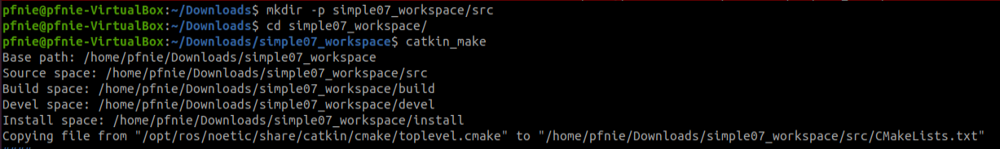

**Step2: start vscode**

```
cd simple07_workspace
code .
```

**Step3: compile ros in vscode**

using ***ctrl + shift + B*** to select ***catkin_make:build***

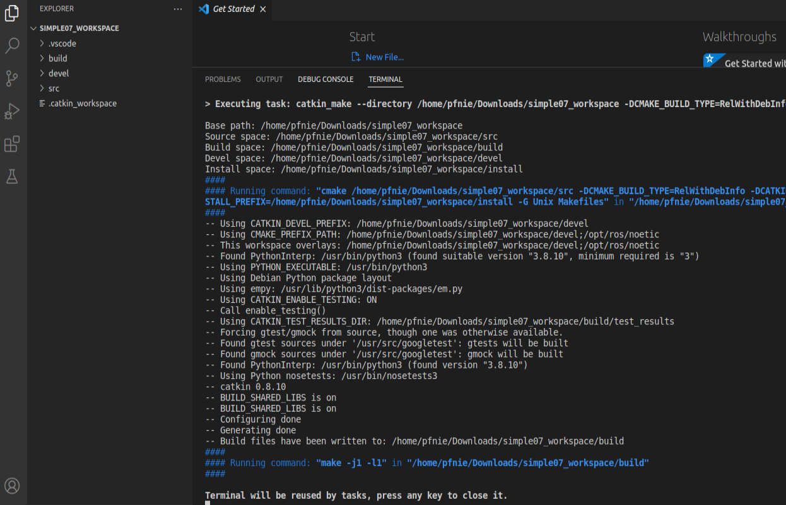

**Step4: config tasks.json**

select ***Configure Default Build Task...*** , then please hit ***catkin_make:build***

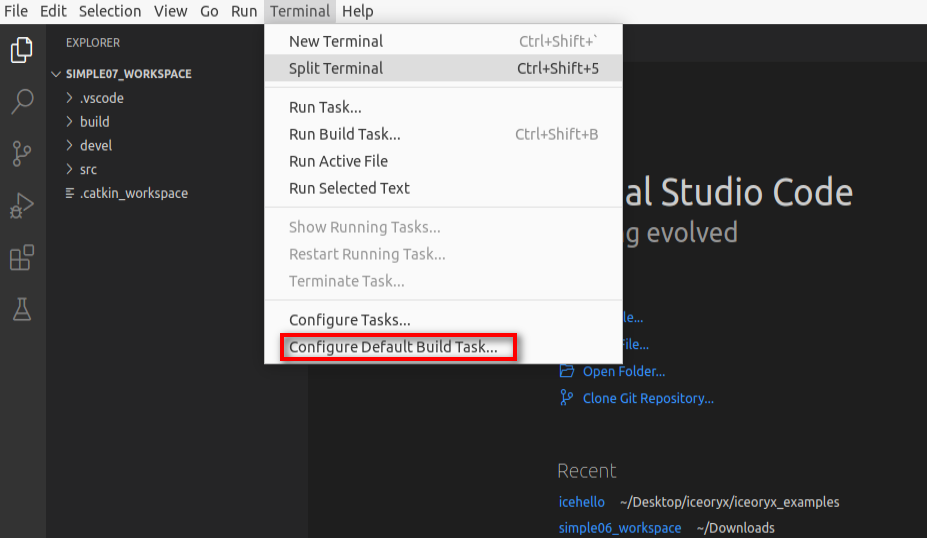

the task.json as below:

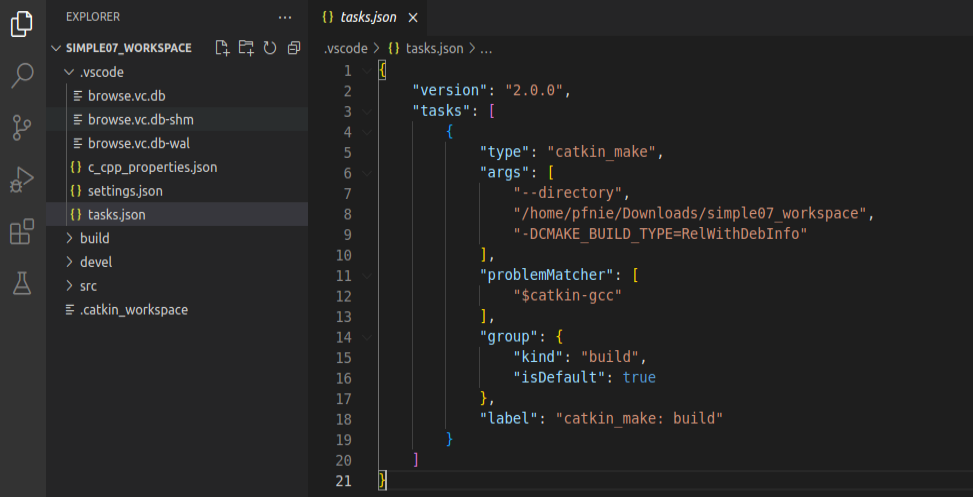

**Step5: create ros package**

Selected src right click ---> create catkin package

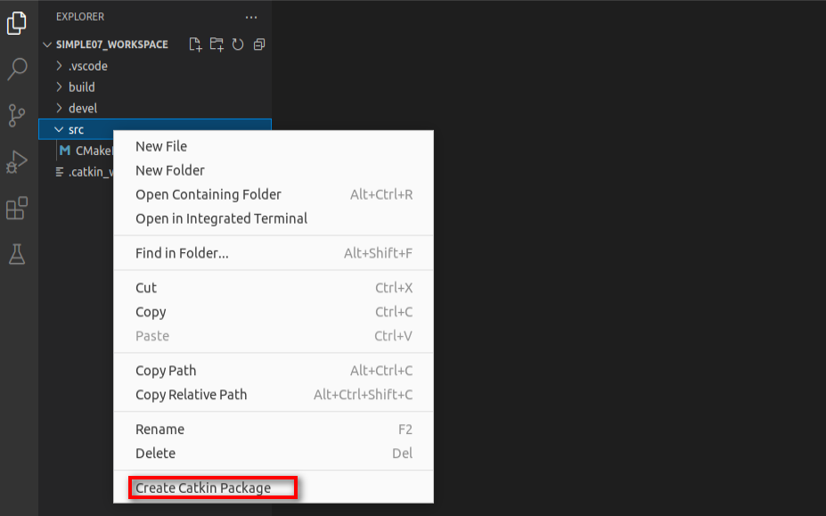

please type your package and dependencies.

```
hello_action_server_client
roscpp rospy std_msgs actionlib actionlib_msgs
```

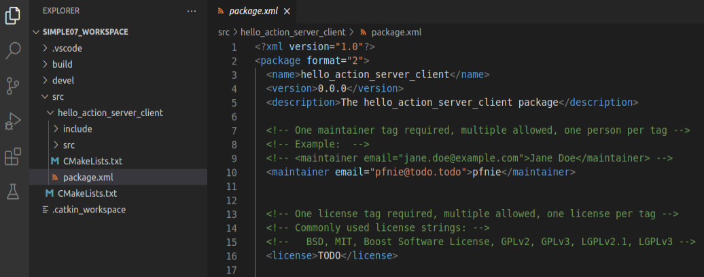

**Step6: create action package and add AddInts.action**

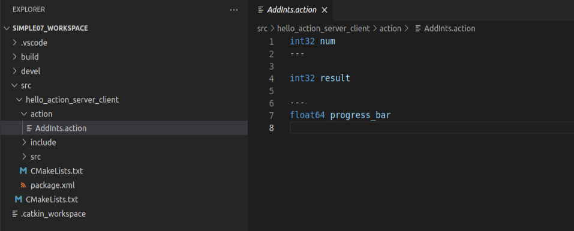

**Step8: config CMakelists.txt**

```
## Find catkin macros and libraries
## if COMPONENTS list like find_package(catkin REQUIRED COMPONENTS xyz)
## is used, also find other catkin packages
find_package(catkin REQUIRED COMPONENTS
  actionlib
  actionlib_msgs
  roscpp
  rospy
  std_msgs
)
```

```
add_action_files(
  FILES
  AddInts.action
)
```

```
generate_messages(
  DEPENDENCIES
  std_msgs
  actionlib_msgs
)
```

```
###################################
## catkin specific configuration ##
###################################
## The catkin_package macro generates cmake config files for your package
## Declare things to be passed to dependent projects
## INCLUDE_DIRS: uncomment this if your package contains header files
## LIBRARIES: libraries you create in this project that dependent projects also need
## CATKIN_DEPENDS: catkin_packages dependent projects also need
## DEPENDS: system dependencies of this project that dependent projects also need
catkin_package(
#  INCLUDE_DIRS include
#  LIBRARIES hello_action_server_client
   CATKIN_DEPENDS actionlib actionlib_msgs roscpp rospy std_msgs
#  DEPENDS system_lib
)
```

**Step9: compile**

using ***ctrl + shift + B*** to select ***catkin_make:build***

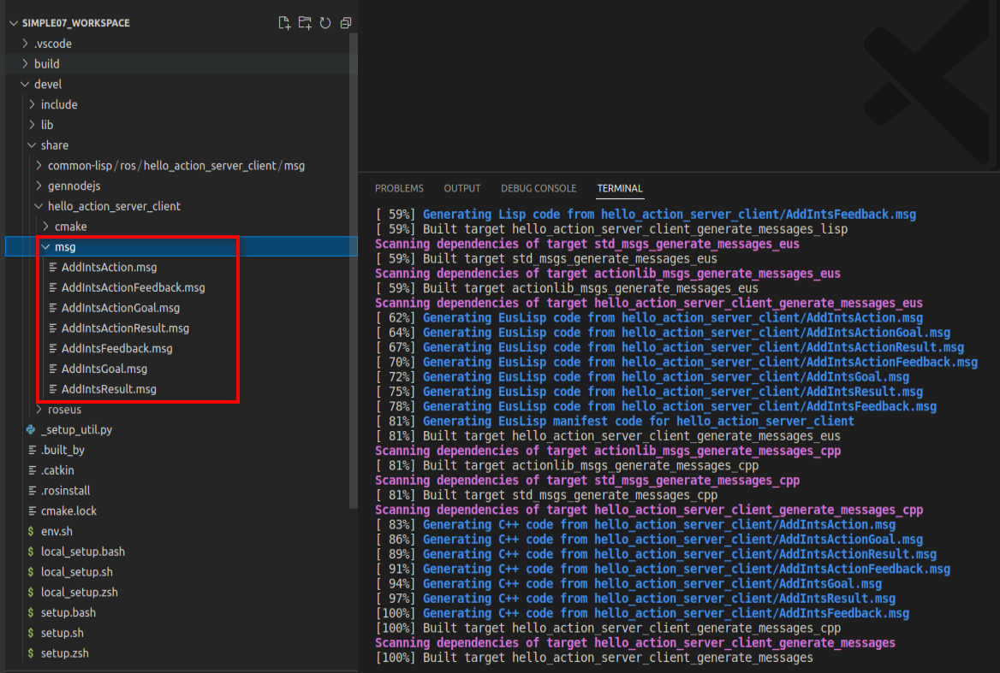

**Step10: update c_cpp_properties.json**

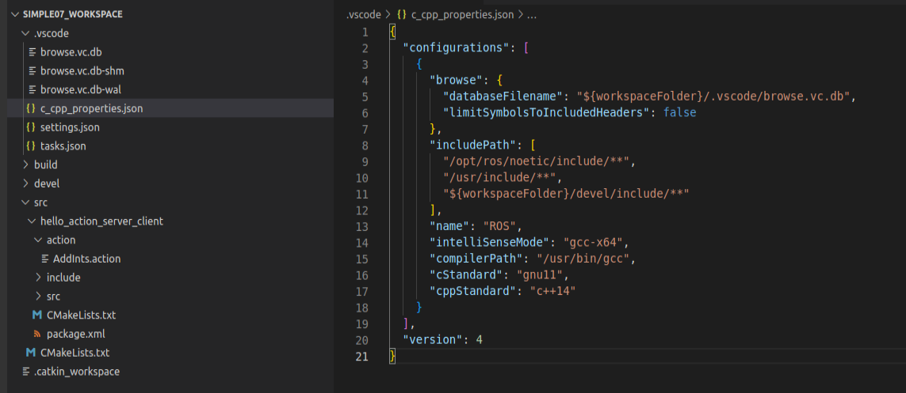

**Step11: add hello_action_server.cpp in src folder**

```
#include "ros/ros.h"
#include "actionlib/server/simple_action_server.h"
#include "hello_action_server_client/AddIntsAction.h"


typedef actionlib::SimpleActionServer<hello_action_server_client::AddIntsAction> Server;


void cb(const hello_action_server_client::AddIntsGoalConstPtr &goal,Server* server){
    //获取目标值
    int num = goal->num;
    ROS_INFO("目标值:%d",num);
    //累加并响应连续反馈
    int result = 0;
    hello_action_server_client::AddIntsFeedback feedback;//连续反馈
    ros::Rate rate(10);//通过频率设置休眠时间
    for (int i = 1; i <= num; i++)
    {
        result += i;
        //组织连续数据并发布
        feedback.progress_bar = i / (double)num;
        server->publishFeedback(feedback);
        rate.sleep();
    }
    //设置最终结果
    hello_action_server_client::AddIntsResult r;
    r.result = result;
    server->setSucceeded(r);
    ROS_INFO("最终结果:%d",r.result);
}

int main(int argc, char *argv[])
{
    setlocale(LC_ALL,"");
    ROS_INFO("action服务端实现");
    // 2.初始化ROS节点;
    ros::init(argc,argv,"AddInts_server");
    // 3.创建NodeHandle;
    ros::NodeHandle nh;
    // 4.创建action服务对象;
    /*SimpleActionServer(ros::NodeHandle n, 
    std::string name, 
    boost::function<void (const demo01_action::AddIntsGoalConstPtr &)> execute_callback, 
    bool auto_start)
    */
    // actionlib::SimpleActionServer<demo01_action::AddIntsAction> server(....);
    Server server(nh,"addInts",boost::bind(&cb,_1,&server),false);
    server.start();
    // 5.处理请求,产生反馈与响应;

    // 6.spin().   
    ros::spin();
    return 0;
}
```

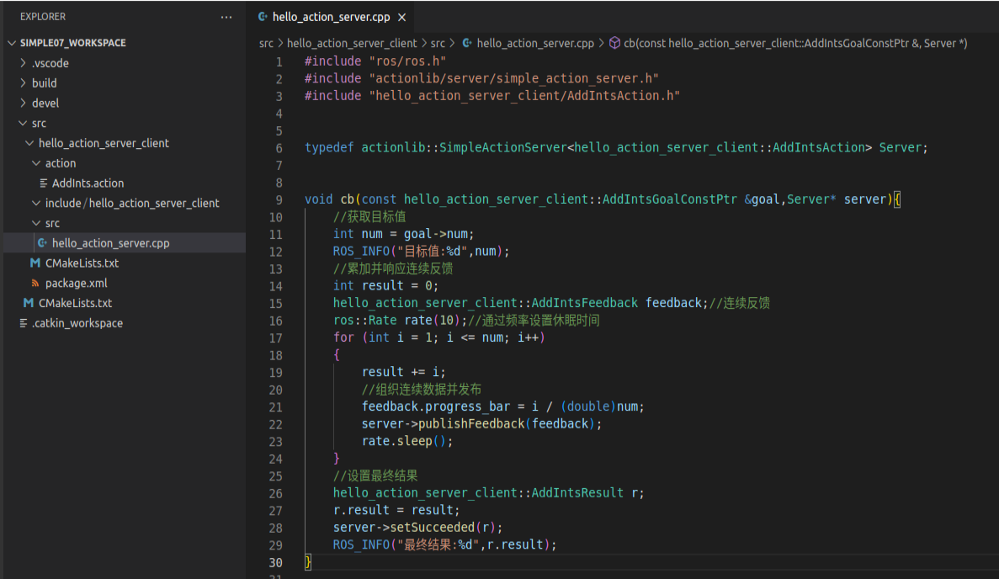

**Step12: add hello_action_client.cpp in src folder**

```
#include "ros/ros.h"
#include "actionlib/client/simple_action_client.h"
#include "hello_action_server_client/AddIntsAction.h"

typedef actionlib::SimpleActionClient<hello_action_server_client::AddIntsAction> Client;


//处理最终结果
void done_cb(const actionlib::SimpleClientGoalState &state, const hello_action_server_client::AddIntsResultConstPtr &result){
    if (state.state_ == state.SUCCEEDED)
    {
        ROS_INFO("最终结果:%d",result->result);
    } else {
        ROS_INFO("任务失败！");
    }

}
//服务已经激活
void active_cb(){
    ROS_INFO("服务已经被激活....");
}
//处理连续反馈
void  feedback_cb(const hello_action_server_client::AddIntsFeedbackConstPtr &feedback){
    ROS_INFO("当前进度:%.2f",feedback->progress_bar);
}


int main(int argc, char *argv[])
{
    setlocale(LC_ALL,"");
    // 2.初始化ROS节点;
    ros::init(argc,argv,"AddInts_client");
    // 3.创建NodeHandle;
    ros::NodeHandle nh;
    // 4.创建action客户端对象;
    // SimpleActionClient(ros::NodeHandle & n, const std::string & name, bool spin_thread = true)
    // actionlib::SimpleActionClient<demo01_action::AddIntsAction> client(nh,"addInts");
    Client client(nh,"addInts",true);
    //等待服务启动
    client.waitForServer();
    // 5.发送目标，处理反馈以及最终结果;
    /*  
    void sendGoal(const demo01_action::AddIntsGoal &goal, 
        boost::function<void (const actionlib::SimpleClientGoalState &state, 
        const demo01_action::AddIntsResultConstPtr &result)> done_cb, 
        boost::function<void ()> active_cb, 
        boost::function<void (const demo01_action::AddIntsFeedbackConstPtr &feedback)> feedback_cb)

    */
    hello_action_server_client::AddIntsGoal goal;
    goal.num = 10;

    client.sendGoal(goal,&done_cb,&active_cb,&feedback_cb);
    // 6.spin().
    ros::spin();
    return 0;
}
```

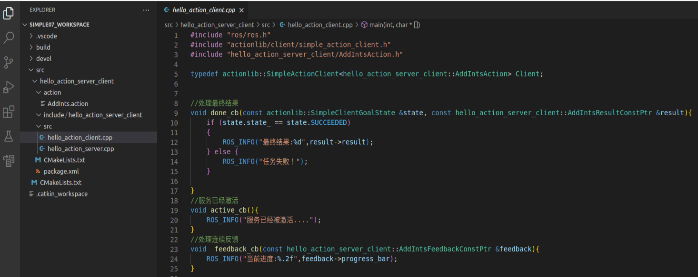

**Step13: config CMakelists.txt**

```
add_executable(hello_action_server src/hello_action_server.cpp)
add_executable(hello_action_client src/hello_action_client.cpp)


add_dependencies(hello_action_server ${${PROJECT_NAME}_EXPORTED_TARGETS} ${catkin_EXPORTED_TARGETS})
add_dependencies(hello_action_client ${${PROJECT_NAME}_EXPORTED_TARGETS} ${catkin_EXPORTED_TARGETS})

target_link_libraries(hello_action_server
  ${catkin_LIBRARIES}
)
target_link_libraries(hello_action_client
  ${catkin_LIBRARIES}
)
```

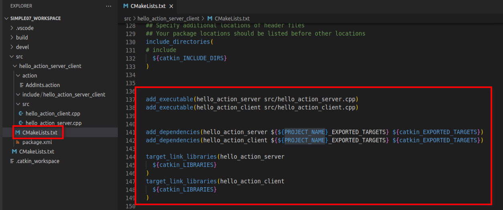

**Step14:  compile**

ctrl + shift + B

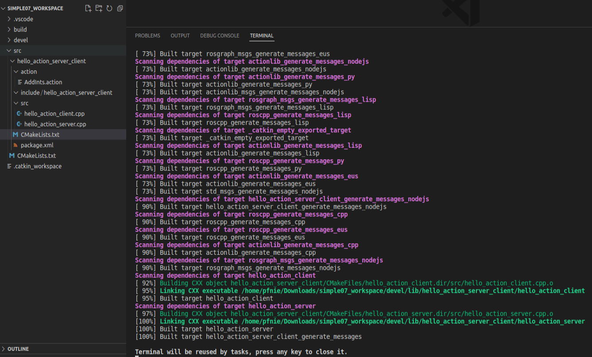

**Step15:  start roscore** **& start hello_command**

```
roscore

cd simple07_workspace
source ./devel/setup.bash
rosrun hello_action_server_client hello_action_server
rosrun hello_action_server_client hello_action_client
```

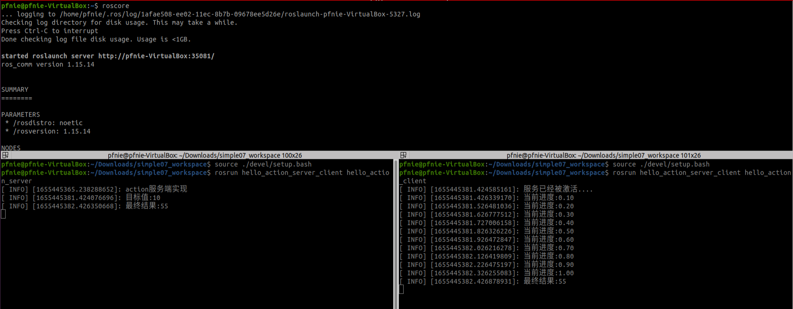

<video width="700" controls>
	<source src="/en/latest/_static/hello_action_server_client.wmv" />
</video>

**Reference：**

1. https://sir.upc.edu/projects/rostutorials/7-actions_tutorial/index.html?highlight=action
1. http://wiki.ros.org/actionlib_tutorials/Tutorials
1. http://wiki.ros.org/actionlib
