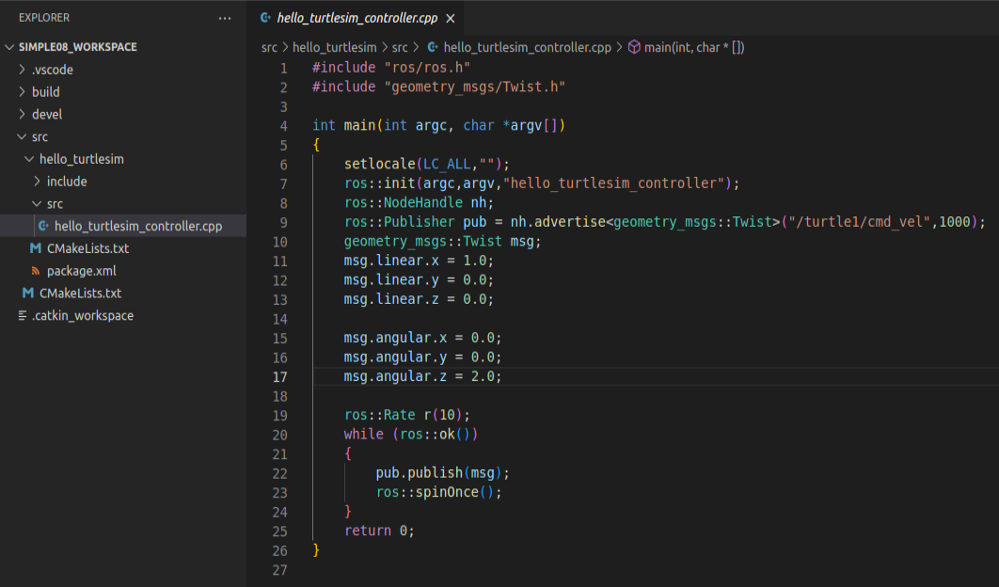

# hello world for turtlesim 

## 1. background

This tutorial session is devoted to learn the ROS synchronous request/response remote procedure calls with feedback and preemption.

## 2. Topic and Message 

So now we can run the turtlesim_node in the turtlesim package.

**Step1: Start rosrun :**

```
roscore
```

**Step2: Then, in a new terminal:**

```
rosrun turtlesim turtlesim_node
```


**Step3: list topic**

```
rostopic list
```


**Step4: message**

```
rostopic type /turtle1/cmd_vel
rosmsg info geometry_msgs/Twist
```


## 3. Tasks

**Step1: create workspace and initialization**

```
mkdir -p simple08_workspace/src
cd simple08_workspace
catkin_make
```


**Step2: start vscode**

```
cd simple08_workspace
code .
```

**Step3: compile ros in vscode**

using ***ctrl + shift + B*** to select ***catkin_make:build***


**Step4: config tasks.json**

select ***Configure Default Build Task...*** , then please hit ***catkin_make:build***


the task.json as below:


**Step5: create ros package**

Selected src right click ---> create catkin package


please type your package and dependencies.

```
hello_turtlesim
roscpp rospy std_msgs geometry_msgs
```


**Step6: add hello_turtlesim_controller.cpp in src folder**

```
#include "ros/ros.h"
#include "geometry_msgs/Twist.h"

int main(int argc, char *argv[])
{
    setlocale(LC_ALL,"");
    ros::init(argc,argv,"hello_turtlesim_controller");
    ros::NodeHandle nh;
    ros::Publisher pub = nh.advertise<geometry_msgs::Twist>("/turtle1/cmd_vel",1000);
    geometry_msgs::Twist msg;
    msg.linear.x = 1.0;
    msg.linear.y = 0.0;
    msg.linear.z = 0.0;

    msg.angular.x = 0.0;
    msg.angular.y = 0.0;
    msg.angular.z = 2.0;

    ros::Rate r(10);
    while (ros::ok())
    {
        pub.publish(msg);
        ros::spinOnce();
    }
    return 0;
}
```



**Step7: config CMakelists.txt**

```
add_executable(hello_turtlesim_controller src/hello_turtlesim_controller.cpp)

target_link_libraries(hello_turtlesim_controller
  ${catkin_LIBRARIES}
)
```

**Step8:  compile**

ctrl + shift + B


**Step9:  start **

```
roscore

rosrun turtlesim turtlesim_node

cd simple08_workspace
source ./devel/setup.bash
rosrun hello_turtlesim hello_turtlesim_controller
```


<video width="700" controls>
	<source src="/en/latest/_static/hello_turtlesim_controller.mp4" />
</video>

**Reference：**

1. https://sir.upc.edu/projects/rostutorials/7-actions_tutorial/index.html?highlight=action
1. http://wiki.ros.org/actionlib_tutorials/Tutorials
1. http://wiki.ros.org/actionlib
1. http://wiki.ros.org/ROS/Tutorials/UnderstandingNodes
