# hello world for custom header file 

## 1. Hello world 1

### 1.1 Background

Design the header file, the executable itself as the source file.

### 1.2 Tasks

**Step1: create workspace and initialization**

```
mkdir -p simple09_workspace/src
cd simple09_workspace
catkin_make
```

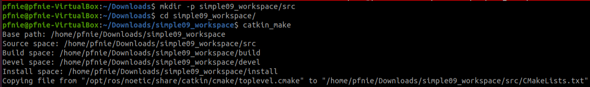

**Step2: start vscode**

```
cd simple09_workspace
code .
```

**Step3: compile ros in vscode**

using ***ctrl + shift + B*** to select ***catkin_make:build***

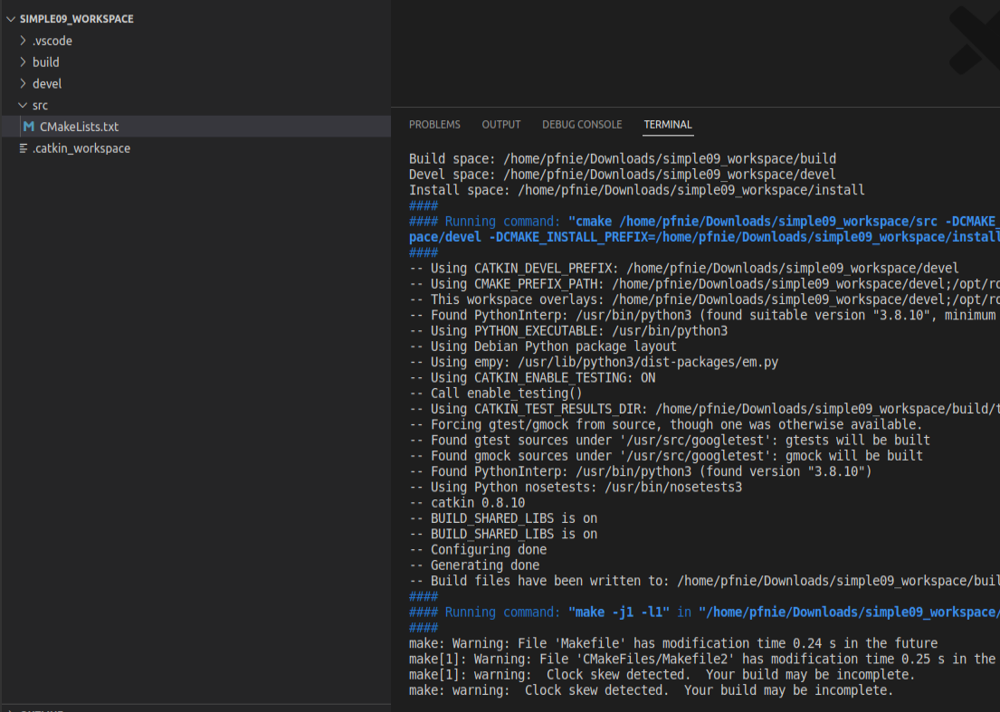

**Step4: config tasks.json**

select ***Configure Default Build Task...*** , then please hit ***catkin_make:build***

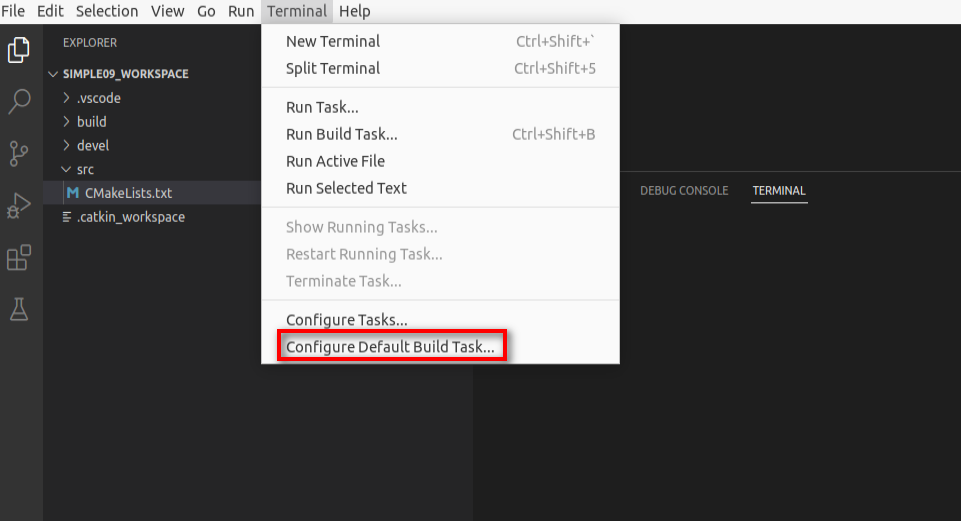

the task.json as below:

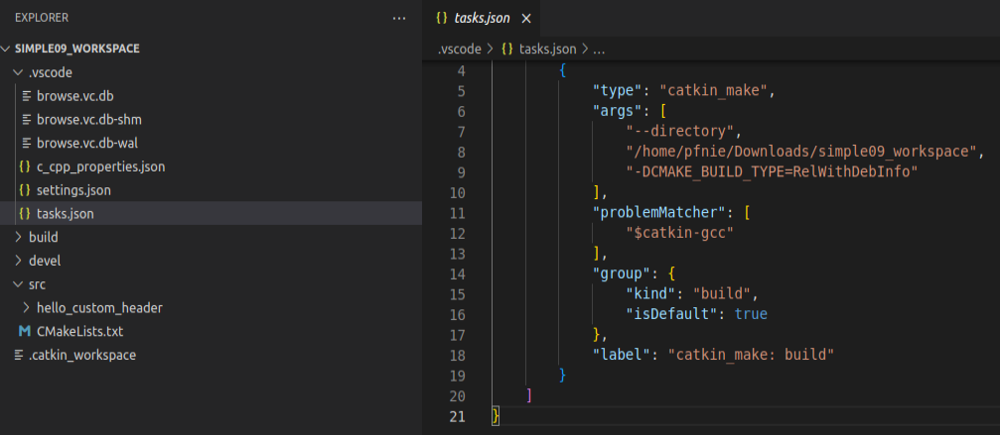

**Step5: edit c_cpp_properties.json**

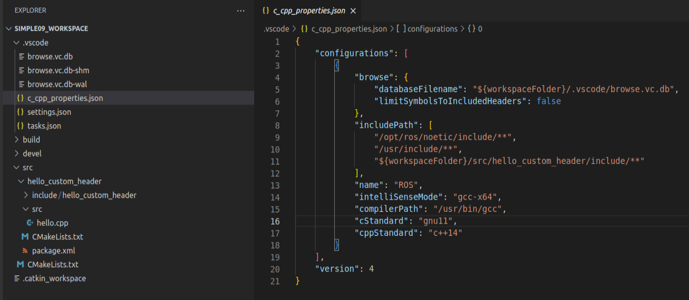

**Step6: create ros package**

Selected src right click ---> create catkin package

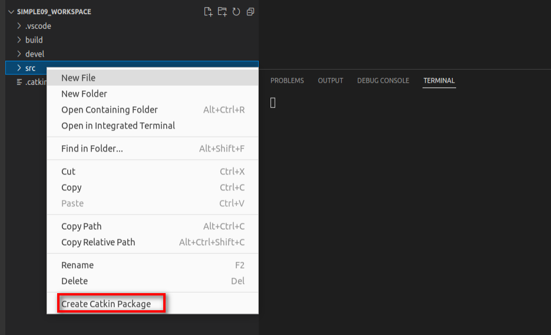

please type your package and dependencies.

```
hello_custom_header
roscpp rospy std_msgs
```

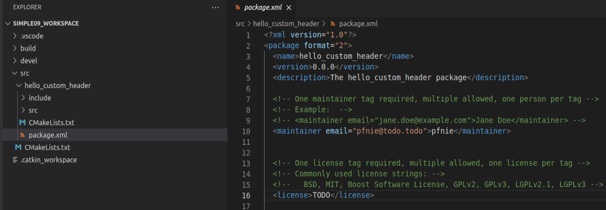

**Step7: add hello.h in include/hello_custom_header folder**

```

namespace hello_ns{

class HelloPub {

public:
    void run();
};

}
```


**Step8: add hello.cpp in src folder**

```
#include "ros/ros.h"
#include "hello_custom_header/hello.h"

namespace hello_ns {

void HelloPub::run(){
    ROS_INFO("自定义头文件的使用....");
}

}

int main(int argc, char *argv[])
{
    setlocale(LC_ALL,"");
    ros::init(argc,argv,"test_head_node");
    hello_ns::HelloPub helloPub;
    helloPub.run();
    return 0;
}
```

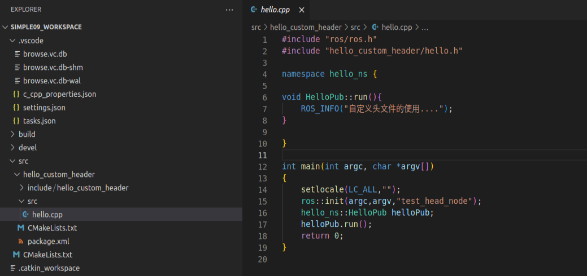

**Step9: config CMakelists.txt**

```
## Specify additional locations of header files
## Your package locations should be listed before other locations
include_directories(
  include
  ${catkin_INCLUDE_DIRS}
)

add_executable(hello src/hello.cpp)

add_dependencies(hello ${${PROJECT_NAME}_EXPORTED_TARGETS} ${catkin_EXPORTED_TARGETS})

target_link_libraries(hello
  ${catkin_LIBRARIES}
)
```

**Step10:  compile**

ctrl + shift + B

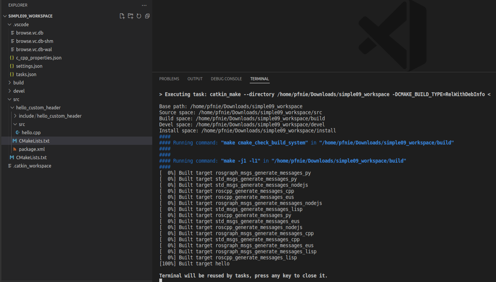

**Step11:  start** 

```
cd simple09_workspace
source ./devel/setup.bash
rosrun hello_custom_header hello
```

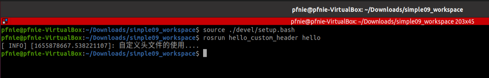

## 2. Hello world 2

### 2.1 Background

Design the header file with the source file and include the header file in the executable file.

### 2.2 Tasks

**Step1: create ros package**

Selected src right click ---> create catkin package


please type your package and dependencies.

```
hello_custom_header_2
roscpp rospy std_msgs
```

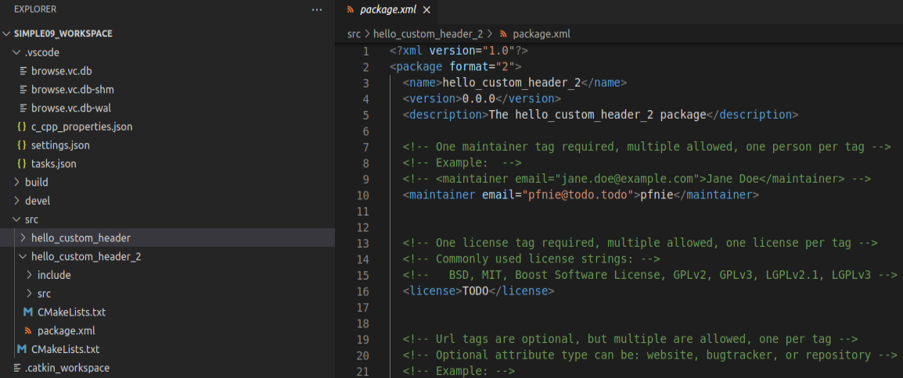

**Step2: add hello2.h in include/hello_custom_header_2 folder**

```
namespace hello_ns{

class HelloPub {

public:
    void run();
};

}
```

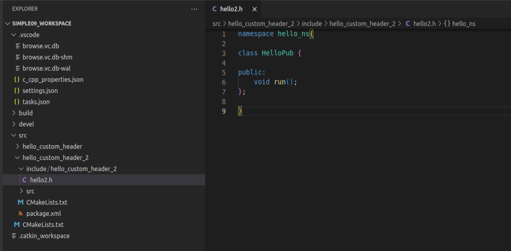

**Step3: add hello2.cpp in src folder**

```
#include "hello_custom_header_2/hello2.h"
#include "ros/ros.h"

namespace hello_ns{

void HelloPub::run(){
    ROS_INFO("hello,head and src ...");
}

}
```

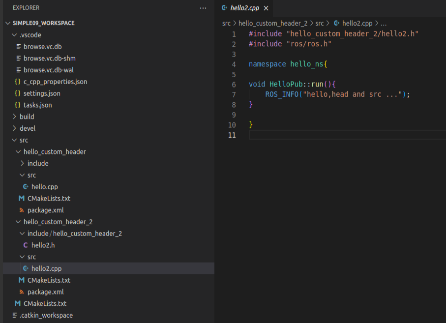

**Step4: add use_header_main.cpp in src folder**

```
#include "ros/ros.h"
#include "hello_custom_header_2/hello2.h"

int main(int argc, char *argv[])
{
    ros::init(argc,argv,"hahah");
    hello_ns::HelloPub my;
    my.run();
    return 0;
}
```

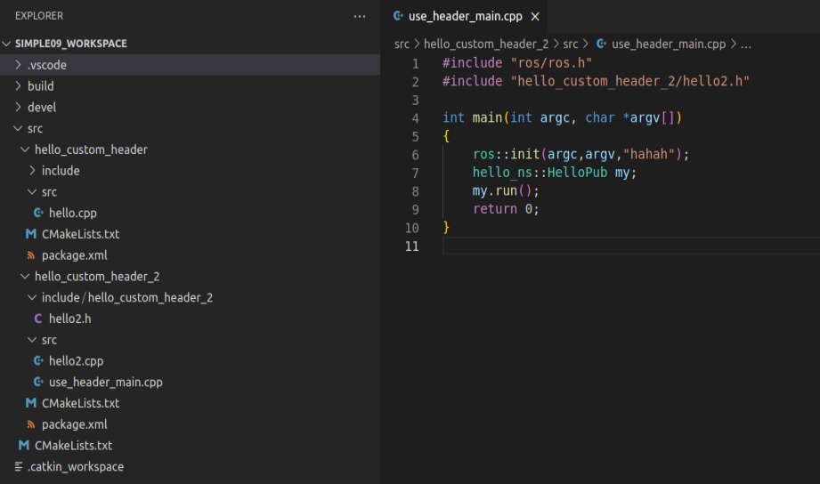

**Step5: config CMakelists.txt**

```
include_directories(
include
  ${catkin_INCLUDE_DIRS}
)

add_library(head
  include/hello_custom_header_2/hello2.h
  src/hello2.cpp
)

add_dependencies(head ${PROJECT_NAME} ${${PROJECT_NAME}_EXPORTED_TARGETS} ${catkin_EXPORTED_TARGETS})

target_link_libraries(head
  ${catkin_LIBRARIES}
)

add_executable(use_head src/use_head.cpp)

add_dependencies(use_head ${${PROJECT_NAME}_EXPORTED_TARGETS} ${catkin_EXPORTED_TARGETS})

target_link_libraries(use_head
  ${catkin_LIBRARIES}
)
```


**Reference：**

1. [https://sir.upc.edu/projects/rostutorials/7-actions_tutorial/index.html?highlight=action](https://sir.upc.edu/projects/rostutorials/7-actions_tutorial/index.html?highlight=action)
1. [http://wiki.ros.org/actionlib_tutorials/Tutorials](http://wiki.ros.org/actionlib_tutorials/Tutorials)
1. [http://wiki.ros.org/actionlib](http://wiki.ros.org/actionlib)
1. [http://wiki.ros.org/ROS/Tutorials/UnderstandingNodes](http://wiki.ros.org/ROS/Tutorials/UnderstandingNodes)
1. [http://www.autolabor.com.cn/book/ROSTutorials/](http://www.autolabor.com.cn/book/ROSTutorials/)
