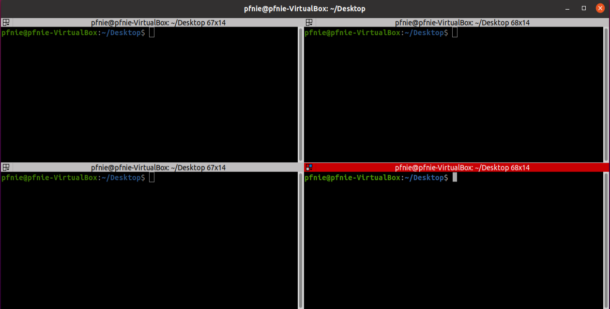
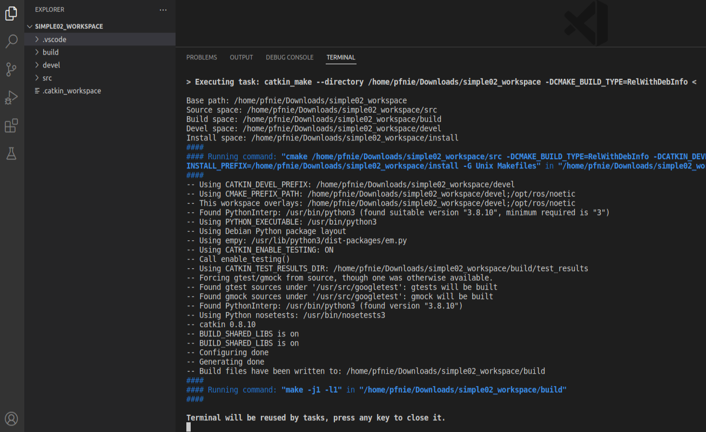
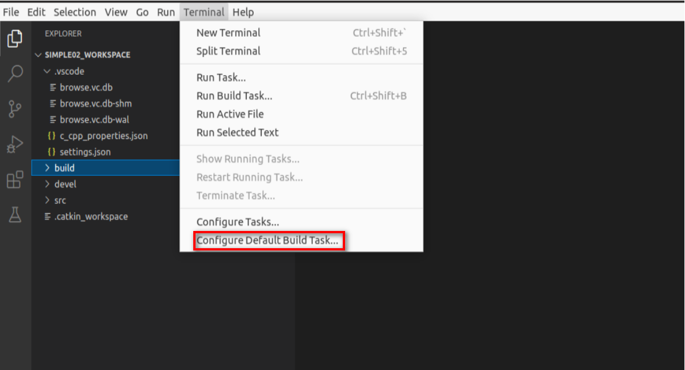
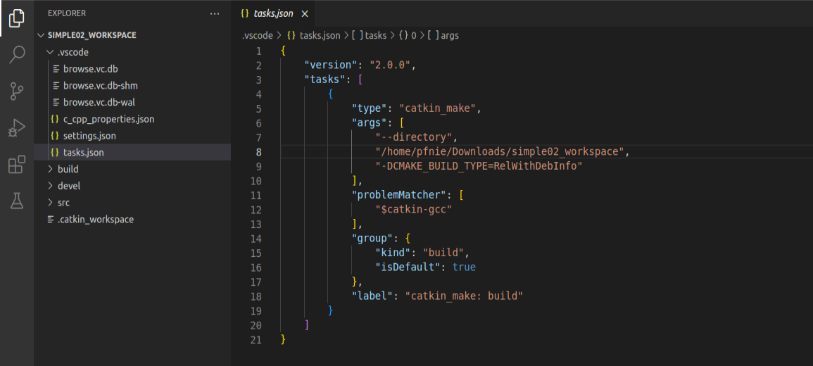
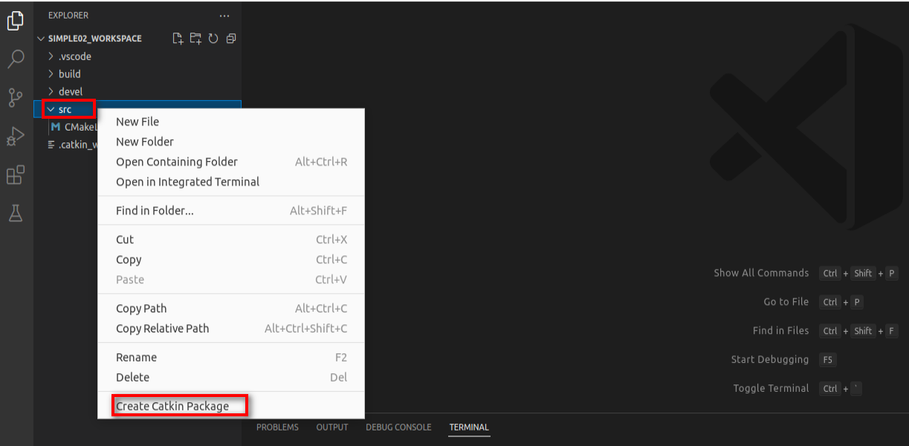
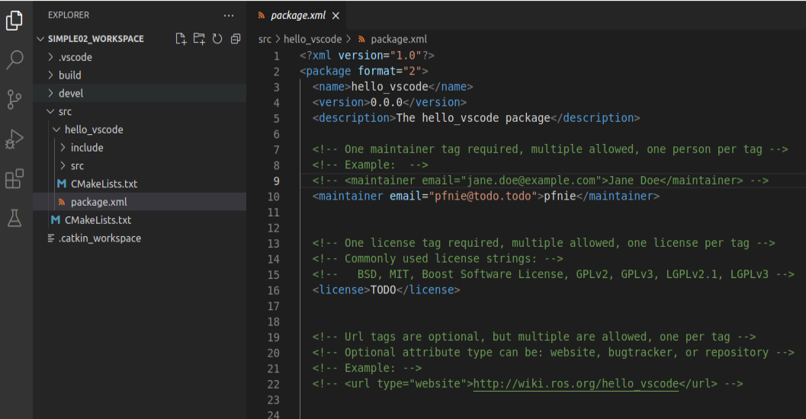
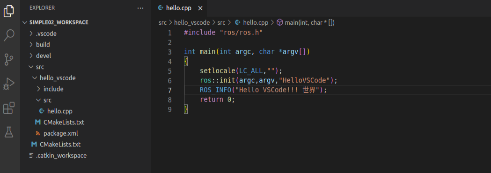
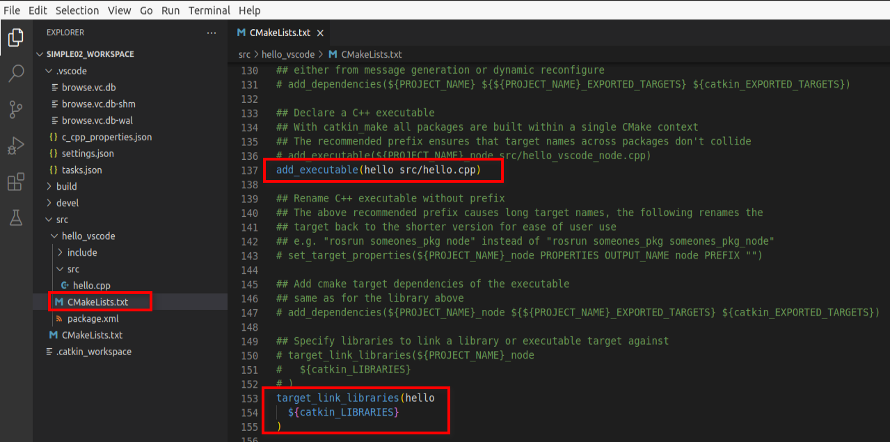
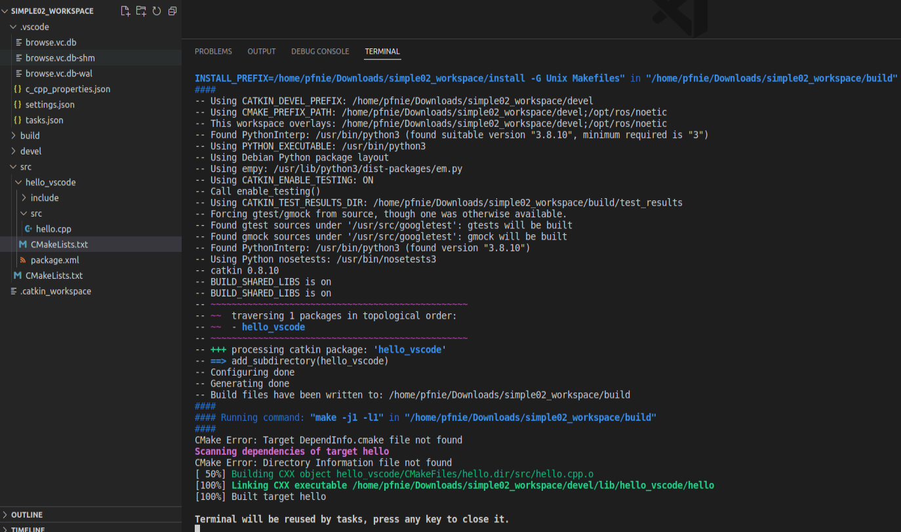

# 02 hello world for vscode

## 1. install terminator

In ROS, the terminal needs to be used frequently, and multiple windows may need to be opened at the same time. It is recommended to use a relatively easy-to-use terminal: Terminator. 

```
sudo apt install terminator
```

The effect is as follows:



## 2. install vscode

VSCode stands for Visual Studio Code. It is a lightweight code editor from Microsoft. It is free, open source and powerful. It supports syntax highlighting, intelligent code completion, custom hotkeys, bracket matching, code snippets, code comparison Diff, GIT and other features of almost all mainstream programming languages, supports plug-in extensions, and is designed for web development and cloud application development optimized. The software supports Win, Mac and Linux across platforms.

vscode download : https://code.visualstudio.com/docs?start=true

vscode history download :https://code.visualstudio.com/updates

**install extensions**


## 3. code in vscode

**Step1: create workspace and initialization**

```
mkdir -p simple02_workspace/src
cd simple02_workspace
catkin_make
```


**Step2: start vscode**

```
cd simple02_workspace
code .
```

**Step3: compile ros in vscode**

using ***ctrl + shift + B*** to select ***catkin_make:build***



**Step4: config tasks.json**

select ***Configure Default Build Task...*** , then please hit ***catkin_make:build***



the task.json as below:



**Step5: create ros package**

Selected src right click ---> create catkin package



please type your package and dependencies.

```
hello_vscode
roscpp rospy std_msgs
```



**Step6: add hello.cpp in src folder**

```
#include "ros/ros.h"

int main(int argc, char *argv[])
{
    setlocale(LC_ALL,"");
    ros::init(argc,argv,"HelloVSCode");
    ROS_INFO("Hello VSCode!!! 世界");
    return 0;
}
```



**Step7: config CMakelists.txt**

```
add_executable(hello src/hello.cpp)
target_link_libraries(hello ${catkin_LIBRARIES})
```



**Step8:  compile**

ctrl + shift + B



**Step9:  start roscore** **& start hello_command**

```
roscore

cd simple02_workspace
source ./devel/setup.bash
rosrun hello_vscode hello
```


**Reference：**

1. [http://wiki.ros.org/action/fullsearch/catkin/commands/catkin_make](http://wiki.ros.org/action/fullsearch/catkin/commands/catkin_make)
2. [https://docs.ros.org/en/rolling/Tutorials/Creating-Your-First-ROS2-Package.html](https://docs.ros.org/en/rolling/Tutorials/Creating-Your-First-ROS2-Package.html)
3. [http://www.autolabor.com.cn/book/ROSTutorials/chapter1.html](http://www.autolabor.com.cn/book/ROSTutorials/chapter1.html)
